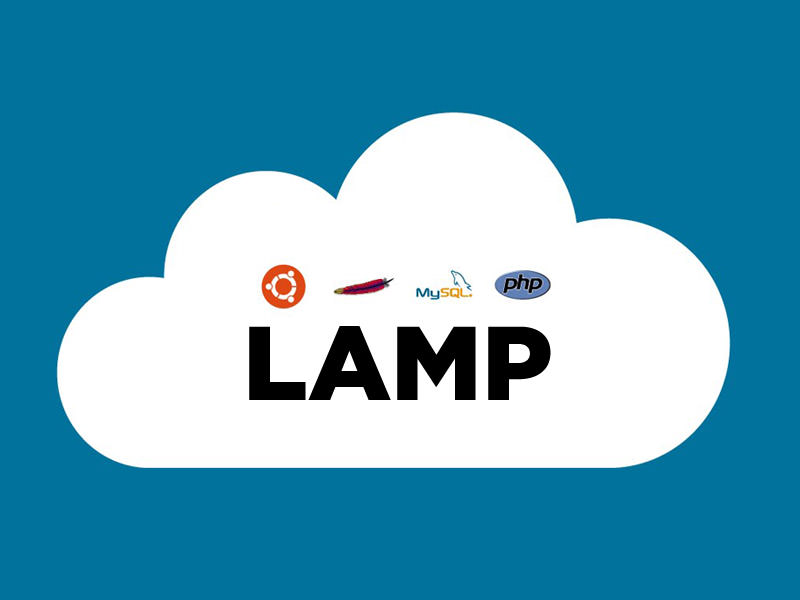

# Initial Server Configuration
   ## Upgrading and installing packages
   + A package is Distribution of software and data in an archive.
      +  Upgrading existing software and installing dependencies.
      +  Set up a file share.
      +  Configure the Apache HTTP Server.
      +  Configure PHP for development.
      +  Install an email debugging server.
   ##  apt-get Command 
   + Command line interface for APT Function:
     + install a package
       + sudo apt-get update
     + remove a package
     + update the package index "List of Software"
     + upgrade packages
       + sudo apt-get update
     + Required "sudo" for elevated privileges.

# MySQL Database Administration
  + Configure MySQL for development
    + > /etc/php/7.0 
    + > type this cmd on windows or mac: sudoedit /etc/mysql/mysql.cnf
    + To use the new configuration enter this cmd:
      + > sudo service mysql restart
  + Manage MySQL permissions
  + connect with MySQL Workbench
  + Create databases and users

# Debugging and Performance

# Installing PHP Applications and Frameworks

# Advanced VirtualBox Techniques

# Troubleshooting a LAMP Server