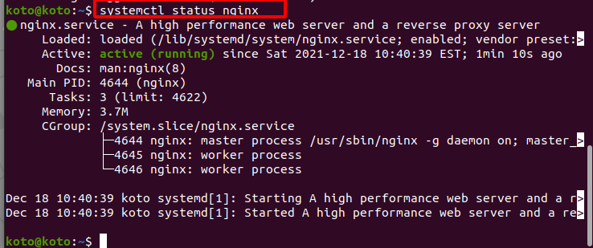
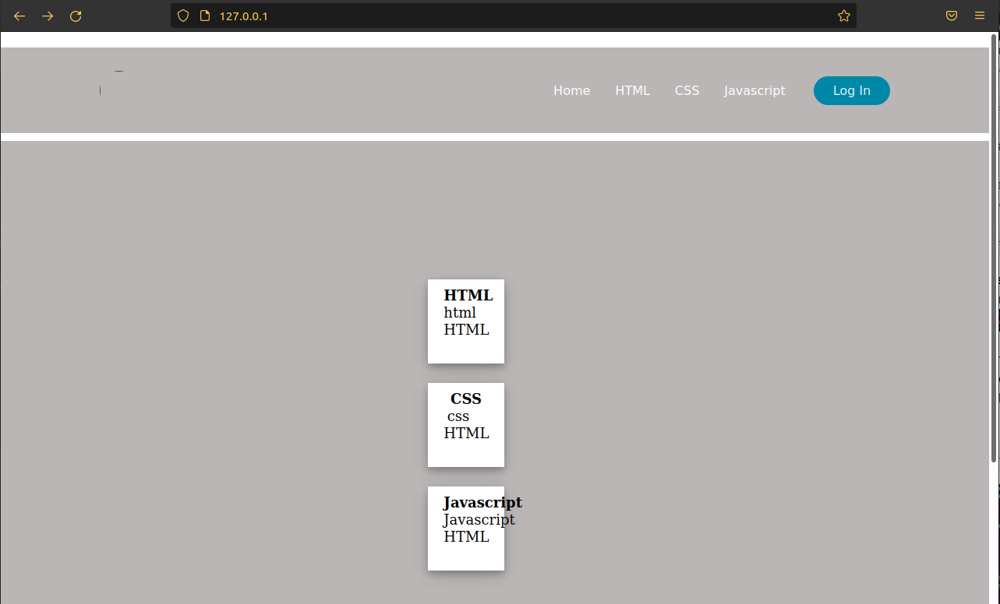

<!-- TOC -->

- [How to install a nginx web server on raspberryPi or Ubuntu.](#how-to-install-a-nginx-web-server-on-raspberrypi-or-ubuntu)
  - [Step 1: Update Raspberry Pi or Any debian favor](#step-1-update-raspberry-pi-or-any-debian-favor)
  - [Step 4: Installing Ngnix](#step-4-installing-ngnix)
  - [step 5: Verifying nginx is running](#step-5-verifying-nginx-is-running)
  - [step 6: Use your browser to see the default site](#step-6-use-your-browser-to-see-the-default-site)
  - [step 6: Finding where the default site is locate](#step-6-finding-where-the-default-site-is-locate)
  - [Deleting the default site and creating a new site](#deleting-the-default-site-and-creating-a-new-site)
  - [Final step:  Verify the new site is working!](#final-step--verify-the-new-site-is-working)
    - [Resources](#resources)

<!-- /TOC -->

# How to install a nginx web server on raspberryPi or Ubuntu.

## Step 1: Update Raspberry Pi or Any debian favor
*  Make sure sure to update your OS before installing Nginx on the server.
   *  Run this commands to update 
  
```
   sudo apt update
```

   *  Run this commands to upgrade
  
```
   sudo apt upgrade
```


---

## Step 4: Installing Ngnix
**NGINX** is open source software for web serving, reverse proxying, caching, load balancing, media streaming, and more. It started out as a web server designed for maximum performance and stability. In addition to its HTTP server capabilities, NGINX can also function as a proxy server for email (IMAP, POP3, and SMTP) and a reverse proxy and load balancer for HTTP, TCP, and UDP servers.
> Run this command to install **nginx**:

```
   sudo apt install nginx
```


## step 5: Verifying nginx is running
Run this command:
```
   systemctl status nginx
```
This is the result of nginx is running or active


---

## step 6: Use your browser to see the default site 
In this part, you will be able to browse the Pi or ubuntu from your computer’s browser. You can access the site by using the IP address in your browser. 


For example:

```
   http:// 127.0.0.1
```


---

## step 6: Finding where the default site is locate
You can run this command to see where that file is located.
```
   vim /etc/nginx/sites-available/default
```


---

## Deleting the default site and creating a new site
Change directory, Before deleting the default site.
Enter this command:
```
   cd /var/www/html
```
This command bring you where the default site is located.
Now you can delete it. 
Enter this command to delete the file;
```
   sudo index.nginx-debian.html
```
   *  Using **sudo** to get the privilege to delete the file. Without that privilege you can not delete the file.


After deleting the default site. Now you can use any text editor to create or edit your site.
Open vi with following file **index.html**
Example:
```
   sudo vi index.html
```


---

## Final step:  Verify the new site is working!
It is working.


---

### Resources
[Tony Teaches Tech](https://www.youtube.com/watch?v=ECsQ8jbpMow)
[LinkedinLearning](https://www.linkedin.com/learning/?u=64897652)
[Prof Robert Alberto](https://github.com/ra559/cis106/blob/main/README.md)


