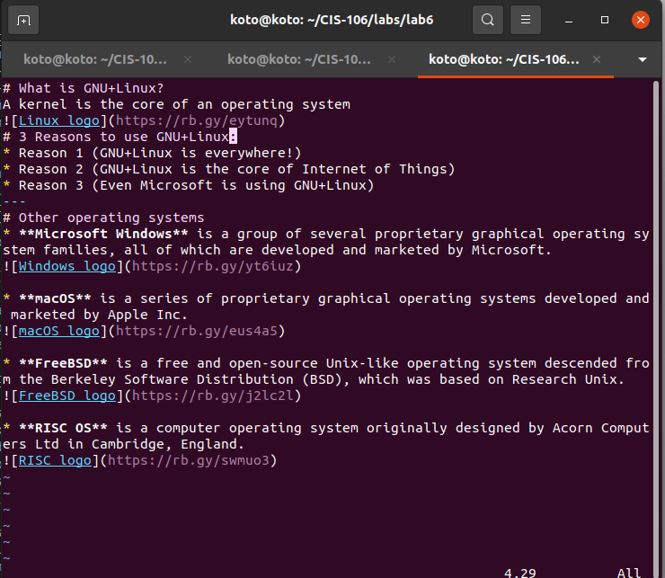

# What is GNU+Linux?
A kernel is the core of an operating system

# 3 Reasons to use GNU+Linux:
* Reason 1 (GNU+Linux is everywhere!)
* Reason 2 (GNU+Linux is the core of Internet of Things)
* Reason 3 (Even Microsoft is using GNU+Linux)
---
# Other operating systems
* **Microsoft Windows** is a group of several proprietary graphical operating system families, all of which are developed and marketed by Microsoft.
 

* **macOS** is a series of proprietary graphical operating systems developed and marketed by Apple Inc.

* **FreeBSD** is a free and open-source Unix-like operating system descended from the Berkeley Software Distribution (BSD), which was based on Research Unix.

* **RISC OS** is a computer operating system originally designed by Acorn Computers Ltd in Cambridge, England.

---
# VIM Screenshot

