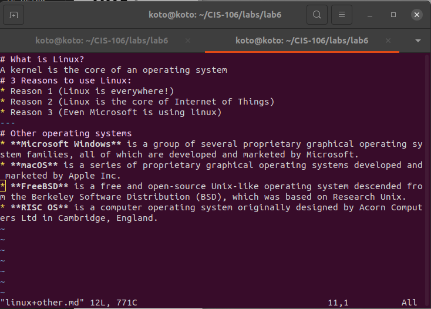

# What is Linux?
A kernel is the core of an operating system
# 3 Reasons to use Linux:
* Reason 1 (Linux is everywhere!)
* Reason 2 (Linux is the core of Internet of Things)
* Reason 3 (Even Microsoft is using linux)
---
# Other operating systems
* **Microsoft Windows** is a group of several proprietary graphical operating system families, all of which are developed and marketed by Microsoft. 
* **macOS** is a series of proprietary graphical operating systems developed and marketed by Apple Inc. 
* **FreeBSD** is a free and open-source Unix-like operating system descended from the Berkeley Software Distribution (BSD), which was based on Research Unix.
* **RISC OS** is a computer operating system originally designed by Acorn Computers Ltd in Cambridge, England.
---
# VIM Screenshot

