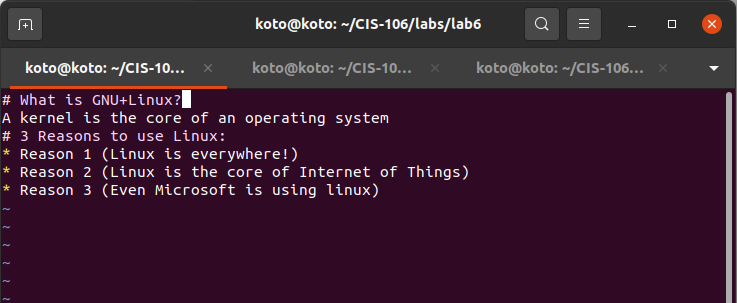

# What is GNU+Linux?
A kernel is the core of an operating system
# 3 Reasons to use Linux:
* Reason 1 (Linux is everywhere!)
* Reason 2 (Linux is the core of Internet of Things)
* Reason 3 (Even Microsoft is using linux)
---
# VIM Screenshot

