#  Final Notes

# Lab 1 Exploring Linux Distributions<!-- TOC -->

- [Final Notes](#final-notes)
- [Lab 1 Exploring Linux Distributions](#lab-1-exploring-linux-distributions)
  - [Requirements:](#requirements)
  - [## Working with Distrowatch](#-working-with-distrowatch)
    - [Question 1](#question-1)
    - [Question 2](#question-2)
    - [Question 3](#question-3)
    - [Question 4](#question-4)
    - [Question 5 (Extra credit 2 pts - Optional)](#question-5-extra-credit-2-pts---optional)
  - [Working with DistroTest.net](#working-with-distrotestnet)
    - [Question 6](#question-6)
- [The basic of Virtualization](#the-basic-of-virtualization)
  - [Definition](#definition)
    - [Two type of virtualization:](#two-type-of-virtualization)
  - [Server-side](#server-side)
  - [Client-side](#client-side)
  - [Type 1 Vs Type 2 Hypervisor](#type-1-vs-type-2-hypervisor)
  - [Benefits of Virtualization](#benefits-of-virtualization)
    - [Example of VMs](#example-of-vms)
    - [Can my computer virtualize?](#can-my-computer-virtualize)
  - [+ Enough free HARD DRIVE space for installing guest OSs.](#-enough-free-hard-drive-space-for-installing-guest-oss)
- [Using VirtualBox](#using-virtualbox)
  - [VirtualBOx Extension Pack](#virtualbox-extension-pack)
  - [Exploring VirtualBox](#exploring-virtualbox)
  - [Creation a Virtual Machine with VirtualBox](#creation-a-virtual-machine-with-virtualbox)
  - [> Click on this link: https://www.youtube.com/watch?v=tjHplNis2kE](#-click-on-this-link-httpswwwyoutubecomwatchvtjhplnis2ke)
- [Installing Ubuntu 20.04 in VirtualBox](#installing-ubuntu-2004-in-virtualbox)
  - [> Click on this link: https://www.youtube.com/watch?v=2MEN_IX8gJ8](#-click-on-this-link-httpswwwyoutubecomwatchv2men_ix8gj8)
- [Raspberry PI](#raspberry-pi)
  - [What's a Raspberry PI?](#whats-a-raspberry-pi)
    - [Raspberry pi Foundation](#raspberry-pi-foundation)
  - [PI COMPONENTS](#pi-components)
    - [The components of the Pi | Raspberry PI 4](#the-components-of-the-pi--raspberry-pi-4)
    - [The components of the Pi | Raspberry PI 3](#the-components-of-the-pi--raspberry-pi-3)
    - [The components of the Pi Zero W](#the-components-of-the-pi-zero-w)
    - [The components of the Pi 3 A+](#the-components-of-the-pi-3-a)
    - [The Raspberry Pi 400](#the-raspberry-pi-400)
    - [A look at the first model of the Raspberry Pi](#a-look-at-the-first-model-of-the-raspberry-pi)
  - [Rasberry Pi SD-Card compatibility](#rasberry-pi-sd-card-compatibility)
  - [What Hardware Do I need?](#what-hardware-do-i-need)
  - [What Software do I need:](#what-software-do-i-need)
- [Working with Raspberry Pi Os](#working-with-raspberry-pi-os)
  - [Raspberry Pi OS boot screen](#raspberry-pi-os-boot-screen)
  - [Different Operating Systems for the Raspberry Pi](#different-operating-systems-for-the-raspberry-pi)
  - [Where to buy?](#where-to-buy)
- [Desktop Environments](#desktop-environments)
  - [|  Pantheon |  Deeping DE  | Fluxbox   |](#--pantheon---deeping-de---fluxbox---)
  - [Desktop Environments (cont)](#desktop-environments-cont)
  - [The GNOME Desktop Environment](#the-gnome-desktop-environment)
  - [The GNOME DE](#the-gnome-de)
  - [Authors](#authors)
  - [Other Desktop Environment](#other-desktop-environment)
    - [The KDE Desktop Environment](#the-kde-desktop-environment)
    - [The XFCE Desktop Environment](#the-xfce-desktop-environment)
    - [The Mate Desktop Environment](#the-mate-desktop-environment)
    - [The Cinnamon Desktop Environment](#the-cinnamon-desktop-environment)
    - [The LXQT Desktop Environment](#the-lxqt-desktop-environment)
    - [The Deepin Desktop Environment](#the-deepin-desktop-environment)
    - [The Pantheon Desktop Environment](#the-pantheon-desktop-environment)
    - [The Raspberry Pi OS Desktop Environment](#the-raspberry-pi-os-desktop-environment)
  - [Sources](#sources)
  - [Useful Resources](#useful-resources)
  - [!resources](#)
- [The Bash Shell](#the-bash-shell)
  - [The History of the Bash Shell](#the-history-of-the-bash-shell)
  - [The Linux Terminal](#the-linux-terminal)
  - [Console Terminals](#console-terminals)
  - [Terminal Emulator](#terminal-emulator)
  - [The Bash Shell](#the-bash-shell-1)
  - [Bash shortcuts | Command Editing Shortcuts](#bash-shortcuts--command-editing-shortcuts)
  - [Shell Prompt](#shell-prompt)
  - [Let's Try some basic commands](#lets-try-some-basic-commands)
  - [Command history](#command-history)
  - [Sources](#sources-1)
  - [!sources](#-1)
- [Hoe to navigate the filesystem](#hoe-to-navigate-the-filesystem)
  - [The Linux Directory Structure](#the-linux-directory-structure)
  - [The Nemo file manager](#the-nemo-file-manager)
    - [Note!](#note)
  - [Navigating the FS in the CLI](#navigating-the-fs-in-the-cli)
    - [The Linux Directory Structure](#the-linux-directory-structure-1)
  - [Commands to move around the filesystem](#commands-to-move-around-the-filesystem)
  - [The pwd command](#the-pwd-command)
  - [The Cd Command](#the-cd-command)
  - [Bash Features](#bash-features)
  - [Listing Files and Directories](#listing-files-and-directories)
    - [Examples of LS command](#examples-of-ls-command)
  - [Special Note](#special-note)
- [Managing Files and Directories](#managing-files-and-directories)
  - [General Knowledge](#general-knowledge)
- [Creating files and Directories](#creating-files-and-directories)
  - [Creating directories](#creating-directories)
    - [The *mkdi*r command](#the-mkdir-command)
  - [Examples of the *mkdir* command](#examples-of-the-mkdir-command)
  - [Creating Files](#creating-files)
  - [Deleting files and directories](#deleting-files-and-directories)
  - [Examples of the *rm* command](#examples-of-the-rm-command)
- [Moving and copying files and directories](#moving-and-copying-files-and-directories)
  - [Moving files and directoires](#moving-files-and-directoires)
  - [Examples of moving files and directories](#examples-of-moving-files-and-directories)
  - [Examples of renaming files and directories](#examples-of-renaming-files-and-directories)
  - [Copying files and directories](#copying-files-and-directories)
    - [The *cp* command](#the-cp-command)
  - [Examples of coying files and directories](#examples-of-coying-files-and-directories)
- [Working with links](#working-with-links)
  - [*Inodes* (index files )](#inodes-index-files-)
  - [Hard Links](#hard-links)
  - [Soft Links](#soft-links)
  - [Getting Help](#getting-help)
  - [Other ways of getting help](#other-ways-of-getting-help)
- [Using *wildcards* (file globbing)](#using-wildcards-file-globbing)
  - [The *Wildcard](#the-wildcard)
    - [Examples of *Wildcard](#examples-of-wildcard)
  - [The *? Wildcard*](#the--wildcard)
  - [The *[] Wildcard*](#the--wildcard-1)
  - [Using Brace Expansion](#using-brace-expansion)
  - [Bonus](#bonus)
  - [Handling text files](#handling-text-files)
  - [Cat](#cat)
  - [Tac](#tac)
  - [More](#more)
  - [Less](#less)
  - [Head](#head)
  - [Tail](#tail)
  - [cut](#cut)
  - [Paste](#paste)
  - [Sort](#sort)
  - [wc](#wc)
  - [Tr](#tr)
  - [Diff](#diff)
  - [Grep](#grep)
  - [Rev](#rev)
- [Working with I/O Redirection.](#working-with-io-redirection)
  - [The pipe (|)](#the-pipe-)
- [Alias](#alias)
  - [Creating you own commands with alias](#creating-you-own-commands-with-alias)
  - [Sources](#sources-2)
  - [What is WIM](#what-is-wim)
  - [Vim modes:](#vim-modes)
  - [Insert text:](#insert-text)
  - [Saving and quitting vim](#saving-and-quitting-vim)
  - [Editing a file with wim](#editing-a-file-with-wim)
  - [Navigating a file](#navigating-a-file)
  - [Moving around Words, sentences, and paragraphs](#moving-around-words-sentences-and-paragraphs)
  - [Searching words in wim](#searching-words-in-wim)
  - [Screen movement](#screen-movement)
  - [Moving to Lines](#moving-to-lines)
  - [Delete text and copy and paste](#delete-text-and-copy-and-paste)
  - [Useful to Know](#useful-to-know)
  - [!toKnow](#-2)
- [Managing Data](#managing-data)
  - [Basic Terminology](#basic-terminology)
  - [Archiving utilities](#archiving-utilities)
  - [The tar program](#the-tar-program)
  - [The CPIO program](#the-cpio-program)
  - [The ar utility](#the-ar-utility)
  - [File Compression](#file-compression)
  - [!fileComp3](#-3)
- [Linux File Permissions](#linux-file-permissions)
  - [Linux File Permissions | File Ownership](#linux-file-permissions--file-ownership)
    - [Ls -l output review](#ls--l-output-review)
    - [Linux File Permissions](#linux-file-permissions-1)
  - [Linux File Permissions | Files vs Directories](#linux-file-permissions--files-vs-directories)
  - [Linux File Permissions | The chmod command](#linux-file-permissions--the-chmod-command)
  - [Linux File Permissions | Symbolic Notation](#linux-file-permissions--symbolic-notation)
  - [Linux File Permission | Numeric Notation](#linux-file-permission--numeric-notation)
- [Managing Users and Groups](#managing-users-and-groups)
  - [Managing User Accounts](#managing-user-accounts)
  - [The /etc/login.defs file](#the-etclogindefs-file)
  - [Creating a basic script](#creating-a-basic-script)
- [Working with variables](#working-with-variables)
  - [Shell scripting | Variables](#shell-scripting--variables)
  - [Shell scripting | Exit Status Codes](#shell-scripting--exit-status-codes)
- [Using Structured Commands](#using-structured-commands)
  - [Shell scripting | Conditions](#shell-scripting--conditions)
    - [Example](#example)
  - [Shell scripting | Comparison operators](#shell-scripting--comparison-operators)
  - [Shell scripting | Looping](#shell-scripting--looping)

<!-- /TOC -->
---
## Requirements:
* **You will use Github to submit this Lab. Watch the 'What is Git and Github?' video before your start**
* Create a Github account before your start this lab.
* Bold your answers *(2 points)*
* Format your screenshots accordingly (not too big, not too small). If I can’t read it, I cannot grade it.
* Video: https://youtu.be/8Sa52S527Qc


## Working with Distrowatch
---
### Question 1
During class, we explored the concept of Linux distribution. During this lab, you will research some Linux distributions using a website called Distrowatch. DistroWatch is a website that provides news, popularity rankings, and other general information about various Linux distributions and other Unix-like operating systems such as OpenSolaris, MINIX and BSD. 

Go to [Distrowatch](https://distrowatch.com/). Explore the website to get familiar with the home page. On the top left corner, you have a form that allows you to submit queries to the website. In the **“Type Distribution Name”** box type **“Ubuntu”.**  This will return details about Ubuntu. Explore the Ubuntu Distrowatch page and answer the following questions:

1. What is the OS Type: 
   * **Linux**

2. Which major distro is it based on?  
   * **Debian**
   
3. Which processor architecture does it support?  
   * **armhf, ppc64el, riscv, s390x, x86_64**

4. Is the distribution active or is it discontinued?  
   * **Active**

5. What is the distro’s home page?  
   * **https://www.ubuntu.com/**

### Question 2
On the top left corner, click on “Random Distribution” and answer the following questions from the distro you got.
1. What is the name of the distribution and the OS Type: 
   * **Linux**

2. Which major distro is it based on?  
   * **Debian, Ubuntu**
   
3. Which processor architecture does it support?  
   * **x86_64**

4. Is the distribution active or is it discontinued?  
   * **Active**

5. What is the distro’s home page?  
   * **http://luninuxos.com/**

### Question 3
On the top of the page, right in the middle, you will find an option that allows you to search for distributions. 
Click on **“Search”** and after the page loads, fill in the following information in the **“Search Distribution by Criteria”** section and Click on Submit Query.
* OS Type: Linux
* Architecture: x86_64
* Status: Active
* Leave the rest as default.

From the query results, choose any distribution and answer the following question about the distro you chose.

1. What is the name of the distribution? 
   * **Linux**
  
2. What is the country of Origin?
   * **France, Taiwan**
  
3. What major distribution is it based on?
   * **Debian, Ubuntu**

4. What is the distribution category?
   * **Live Medium, Netbooks**
  
5. Which processor architecture, aside from the one in the original query, does the OS support?
   * **i686, x86_64**

### Question 4
Now that you know how to use Distrowatch. Find a Linux distribution for the following scenarios. For each distribution provide the website, name, and supported architecture.

1. A Linux distribution used for Data Rescue/Data recovery
* Distro Name: **Kali Linux (formerly BackTrack)**
* Website: **http://www.kali.org/**
* Desktop Environment: **Enlightenment, GNOME, KDE Plasma, LXDE, MATE, Xfce**

2. A Linux distribution used for Education that supports the ix86 processor architecture.
* Distro Name: **Puppy Linux**
* Website: **http://www.puppylinux.com/**
* Desktop Environment: **JWM, Openbox**

3. A Linux distribution that supports the OEM installation method
* Distro Name: **Kubuntu**
* Website: **http://www.kubuntu.org/**
* Desktop Environment: **KDE Plasma**

### Question 5 (Extra credit 2 pts - Optional)
On the Distrowatch homepage in the menu located in the middle of the page, you will find an option called **“Submit Distribution”.** This option lists all the Linux distros that are pending evaluation, on development or that are experiencing some sort of legal constraint.  Select one of these distributions and in a paragraph, share your thoughts. (keep it simple 5 to 8 sentences).
**Type your paragraph here**


## Working with DistroTest.net
### Question 6
DistroTest.net is a project that allows you to test Linux/BSD distributions on your web browser. This website is great for trying out distributions before you even download the ISO file. Go to [Distrotest.net](https://distrotest.net/) and click on any of the distributions. Start the distribution and take a screenshot of the browser window that just popped up.


Locate the terminal application in the distribution you started and type the following command: `uname -a` Take a screenshot of the browser window showing the terminal application open.


Stop the machine and take a screenshot of the browser window showing that the machine has been stopped.


# The basic of Virtualization
## Definition
Replication of hardware o simulate a virtual machine inside a physical machine.

### Two type of virtualization:

* Server-side virtualization
* Client-side virtualization
 
## Server-side 
Virtual Desktop Infrastructure (VDI).
    
* Thick client or fat client
* Thin client
* Zero client

## Client-side 
* Software installed on a computer to manage virtual machines
* Each VM has its own OS installed
* The computer needs:
    * A hypervisor 
    * Hardware support
      * Capable CPU
      * Enough RAM
      * Enough STORAGE

## Type 1 Vs Type 2 Hypervisor


## Benefits of Virtualization 

+ Allows running multiple OSs on one machine.
+ Reduces costs by decreasing the physical hardware that must be purchased for a network.

### Example of VMs

+ VirtualBox
  + It is **Type 2** virtualization product 
  + Open Source software
  + supports a **Large** number of guest OSs

+ VMWare Workstation Player
  + Type 2
  + Available for **Linux** and **Windows**
  + supports a **Large** number of guest OSs

### Can my computer virtualize?

Your computer should meet the following minimal specifications:
+ AMD V or INTEL V compatible processor
+ DUAL core x64 processor with 1.3 GHz or faster 4GB of RAM
+ Enough free HARD DRIVE space for installing guest OSs.
---
# Using VirtualBox
## VirtualBOx Extension Pack

+ Base Package
+ Extension pack
  1. The virtual USB 2.0 (EHCI) device.  
  2. The virtual USB 3.0 (xHCI) device. 
  3. VirtualBox Remote Desktop Protocol (VRDP) support.
  4. Host webcam passthrough.
  5. Intel PXE boot ROM.
  6. Disk image encryption with AES algorithm.
+ To install VirtualBox Extension Pack just double click on the file.

## Exploring VirtualBox


## Creation a Virtual Machine with VirtualBox

> Click on this link: https://www.youtube.com/watch?v=tjHplNis2kE
---

# Installing Ubuntu 20.04 in VirtualBox

> Click on this link: https://www.youtube.com/watch?v=2MEN_IX8gJ8
---
# Raspberry PI
**Download the free ebook:** https://magpi.raspberrypi.org/books/beginners-guide-4th-ed

## What's a Raspberry PI?
+ The Raspberry pi is a low cost
+ Credit-card sized computer that plugs into a computer monitor or TV
+ It's capable of doing everything you'd expect a desktop computer to do.

### Raspberry pi Foundation 
+ The Raspberry pi Foundation is registered educational charity based in the UK
+ Goal is to advance the education of adults and children, particularly in the field of computer science and related subjects.

## PI COMPONENTS 
### The components of the Pi | Raspberry PI 4 


### The components of the Pi | Raspberry PI 3 


### The components of the Pi Zero W 


### The components of the Pi 3 A+ 


### The Raspberry Pi 400 


### A look at the first model of the Raspberry Pi


## Rasberry Pi SD-Card compatibility 
> https://elinux.org/RPi_SD_cards

## What Hardware Do I need?


## What Software do I need: 
+ Download **Raspberry Pi Imager**. 

# Working with Raspberry Pi Os 
## Raspberry Pi OS boot screen 


## Different Operating Systems for the Raspberry Pi
+ Ubuntu
+ Kali Linux
+ Diet pi
+ Arch Linux
+ Elementary OS
+ Manjaro
+ Windows 10
+ Android

## Where to buy?
+ Amazon
+ Microcenter


---


# Desktop Environments
* Before DE there was the CLI
  
|  GNOME |   KDE   |  XFE  |
| ------ | --------| -----|
|   MATE  |  BUDGIE |  LXDE   |
|   Cinnamon | Openbox  |  LXQT  |
|  Pantheon |  Deeping DE  | Fluxbox   |
---
## Desktop Environments (cont)
   * GUI: A Graphical User Interface 
   * DE: A Desktop Environment
   * Different Linux Distributions ship with different desktop environments. The most common being GNOME and KDE. 
     * Desktop Settings
     * Displays Manager
     * File Manager
     * Icons
     * Favorites Bar
     * Launcher
     * Menus
     * Panels
     * System Tray
     * Widgets
     * Window Manager

## The GNOME Desktop Environment
## The GNOME DE
   * The default desktop in Ubuntu is GNOME 3.
     * Debian 
     * Fedora
     * Red Hat Enterprise Linux
     * Oracle Linux
   * GNOME was an acronym for **GNU Network Object Model Environment** .
   * GNOME was started on **August 15, 1997, by Miguel de Icaza and Federico Mena**.

## Authors


## Other Desktop Environment
### The KDE Desktop Environment

### The XFCE Desktop Environment
   * XFCE is a lightweight desktop environment that aims to be fast and low on system resources, while still being appealing and user friendly.
   * The XFCE project was started by Olivier Fourdan in 1996.
 

### The Mate Desktop Environment 
   * The Mate is the continuation of GNOME 2.


### The Cinnamon Desktop Environment 


### The LXQT Desktop Environment


### The Deepin Desktop Environment


### The Pantheon Desktop Environment


### The Raspberry Pi OS Desktop Environment


## Sources 


## Useful Resources

---
# The Bash Shell
## The History of the Bash Shell
   * Shells make large-scale IT possible.
   * They're a necessary component to modern computing.

## The Linux Terminal 
   * CLI- A Command-Line Interface 
     * They are **Two ways** to access the CLI:
       * *Terminal Emulator*
       * *Linux Console* 

## Console Terminals


## Terminal Emulator


## The Bash Shell
   * The GNU bash shell is  program that provides interactive access to the Linux system

## Bash shortcuts | Command Editing Shortcuts


## Shell Prompt


## Let's Try some basic commands
   + **date**   *displays the current time and date*
   + **cal**    *displays a calendar of the current month*
   + **df**     *displays the current amount of free space on our disk drives*
   + **free**   *displays the amount of free memory*
   + **uname**  *displays information about your system*
   + **clear**  *clears the screen*

## Command history 


## Sources 

---

# Hoe to navigate the filesystem

## The Linux Directory Structure


## The Nemo file manager


### Note!
   > There are a bunch of file mangers options for Linux.

## Navigating the FS in the CLI
### The Linux Directory Structure


## Commands to move around the filesystem


## The pwd command
   > Displays the current working directory

## The Cd Command
   > Changes the current working directory. 


## Bash Features
   * **Tab Completion** - autocompletes a command by pressing the tab key
   * **Arrow Keys** - allows you to move, edit, and repeat commands
   * **Ctrl + a** - go to the start of the command line
   * **Ctrl + e** - go to the end of command line 

## Listing Files and Directories


### Examples of LS command
  * **ls** - List the content of the present working directory
  * **ls -a** - List all the files inside the current working directory including hidden files.
  * **ls -a ~/Pictures** - List all the files inside a given directory.
  * **ls -lr ~/Pictures** - Long list all the files inside a given directory recursively.


## Special Note


# Managing Files and Directories
## General Knowledge
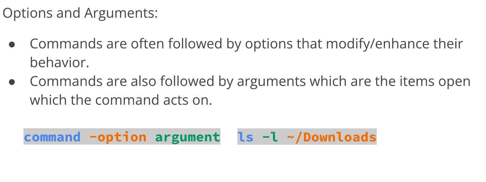

# Creating files and Directories
## Creating directories 
### The *mkdi*r command
   *  *mkdir* is used for creating a single directory or multiple directories.
      > mkdir + the name of the directory.
   * To create multiple directories, separate each directory name with a space.
   * If you try to create a directory that already exists, you will get an error notifying you that the file already exists.

## Examples of the *mkdir* command


## Creating Files 
* The touch command
  * touch is used for creating files
    * Examples: 
      * To create a file called list
        * **touch** list
      * To create several files:
        * **touch** list_of_cars.txt Script.py names.csv
      * To create a file using absolute path:
        * **touch** ~/Downloads/games.txt
   > **Note: Creating files is not the designed purpose of the touch command. The touch command updates any given file's timestamp. But, if the file does not exists, it creates it. 

## Deleting files and directories
* The **rm** command
  * **rm** removes files. Does not removes directories.
  * To remove a non-empty directory use **rm** with the **-r** option.
  * To remove empty directories use the **rmdir** command.

## Examples of the *rm* command


# Moving and copying files and directories

## Moving files and directoires

**The *mv* command**
   *  mv moves and renames directores.
      *  > **mv** + source + destination
      *  > **nv** + file/directory to rename + new name
   * Both source and destination can be an **absolute or a relative path**.

## Examples of moving files and directories


## Examples of renaming files and directories
   *  To rename a file
      *  **mv** homework.docs cis106homework.docx
   *  To rename a file using absolute path
      *  **mv** ~/Downloads/homework.docs ~/Downloads/cis106homework.docx
   *  To move and rename a file in the same command
      *  **mv** Downloads/cis106homework.docs Documents/new_cis106homework.docx

## Copying files and directories 
### The *cp* command
*  **cp** copies files/directories from a source o a destination.
*  the **cp** command used the same structure as the **mv**
   *  > **cp** + files to copy + destination 
* To copy directories you must use the **-r** option 
   * > **cp -r** + directories to copy + destination 

## Examples of coying files and directories


# Working with links

## *Inodes* (index files )


## Hard Links


## Soft Links


## Getting Help 

   * Man (manual) pages are documentation files that describe Linux shell commands, executable programs, system calls, special files, and so forth.
   * To view the manual of a command type: **man** + command.
     * > Example:  **man ls**
   * To exit the **man** page press letter "**q**".
  
 

## Other ways of getting help


# Using *wildcards* (file globbing)


## The *Wildcard
   *  The main wildcard is a star, or asterisk (*) character.
   *  The **star alone** matches anything and nothing and matches any number of characters.
      *  For example, **ls *.txt**will match all files that end in **.txt**.
      *  Examples of when to use **the *wildcard:**
         *  to list all files with a particular file extension. 
         *  Do not remember the complete name of a file but you remember a prtion of the name.
         *  Want to copy, move, or remove all files that match a particular naming convention.

### Examples of *Wildcard


## The *? Wildcard*


## The *[] Wildcard*


## Bonus
   * **ranger** - visual file manger
     * **Installation:** *sudo apt install ranger*
     * **Usage: ranger**
   * **Nnn**
     * **Installation:** *sudo apt install ranger*
     * **Usage: ranger**# Handling Text Files

## Handling text files

   + Linux offers a lot of command line tools for handling text
     + cat
     + tac
     + more
     + less
     + head
     + diff
     + tail
     + cut
     + past
     + sort
     + wc
     + tr
     + grep


## Cat


## Tac


## More
   * The **more** command is a pager program used for displaying the content of text file one page at a time.
   * Usage:
     * > **more** + file to view.
     * > *For more information, read the man page of the more command*.

## Less
   * The **less** command is another pager program that displays the content of file 1 page at time.
   * **Less** is faster than more when dealing with large files since it loads 1 page at time.
     * Usage:
       * > **less** + file to view
       * > *For more information, read the man page of the more command*.

## Head
   * The **head** command displays the top **N** number of lines of a given file.
   * By default, it prints the first 10 lines.
     * Usage:
       * > **head** + **option** + **file**
       * > *For more information, read the man page of the more command*.

## Tail
   * The **tail** command displays the las **N** number of lines a given file.
   * By default, it prints the last 10 lines.
     * Usage:
       * > **tail** + **option** + **file**
       * > *For more information, read the man page of the more command*.

## cut 


## Paste
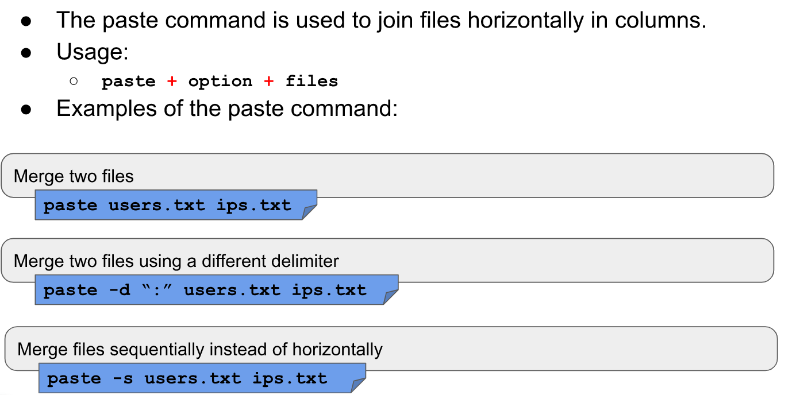

## Sort
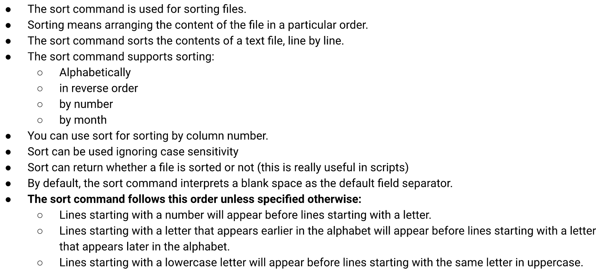
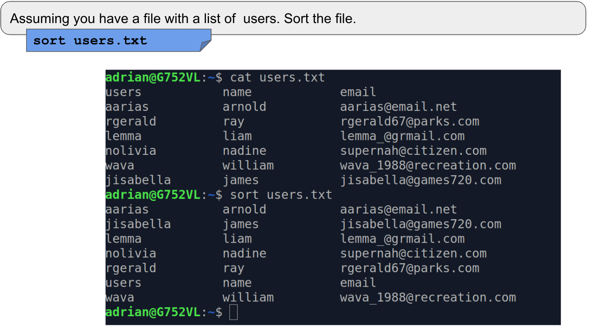

## wc
   * The **wc** command is used for printing the number of lines, and bytes in a file.
   * Usage:
     * > **wc** + **option** + **file**

## Tr
   * The **tr** command is used for translating or deleting characters from standard output.
     * > **standard output** | **tr** + **option** + **set** + **set**

## Diff
   * The **diff** command compares files and displays the differences between them 
     * > diff + option + file1 + files2

## Grep 
   * The **grep** command is used to match a string pattern from a file or standard output when using the pipe
     * > grep + option + pattern to match + file
     * standard output + pipe | + grep + pattern to match


## Rev
   * The **rev** command is used for reversing the characters position in a given text.
     * > **rev** + file

# Working with I/O Redirection.
   * In Inux, we can redirect the **input and output** of commands to and from files, as well as connect multiple commands together into powerful command piperlines.

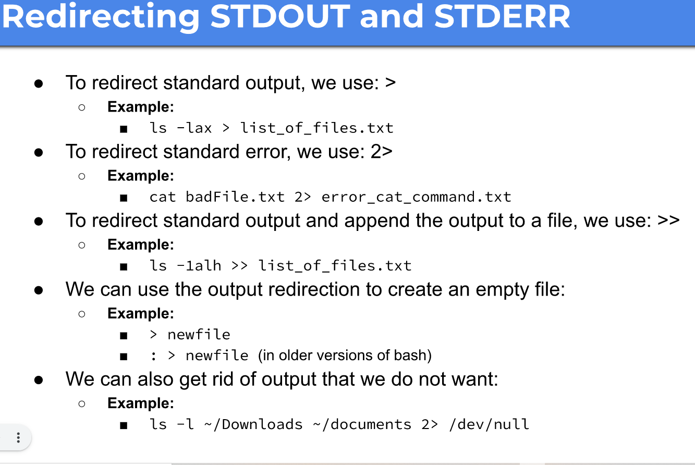
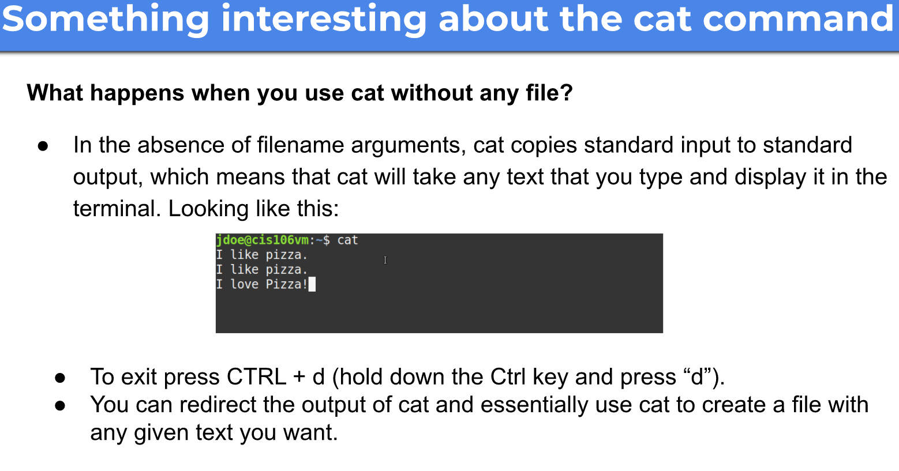

## The pipe (|)


# Alias
## Creating you own commands with alias
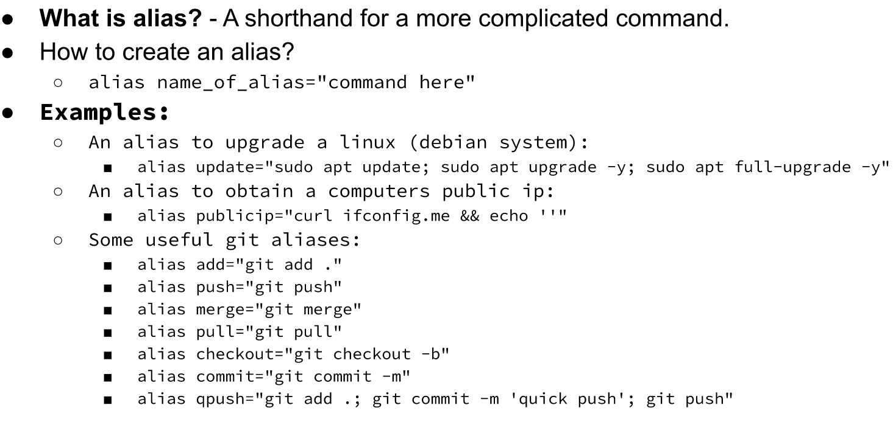
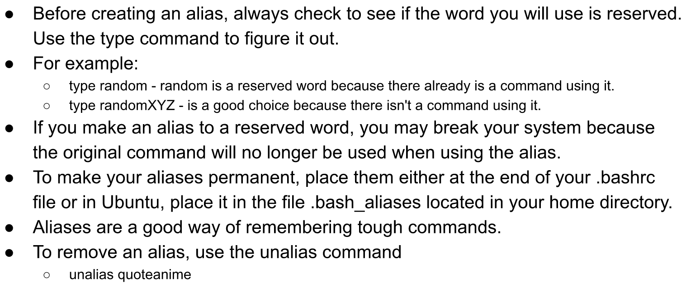

## Sources
# Vim
## What is WIM

*  The **vi command-line** text editor is included in all POSIX compliant OS.
*  The **vi command** is now linked to the **vim command**.
*  Even when you issue the **vi command**, you're actually starting the **vim editor**.
   *  To install vim
      *  > sudo apt install vim
   * If **vi** is installed in all Linux distros, Why am i learning **VIM**?
     * vim had more features
     * vim is also light weight

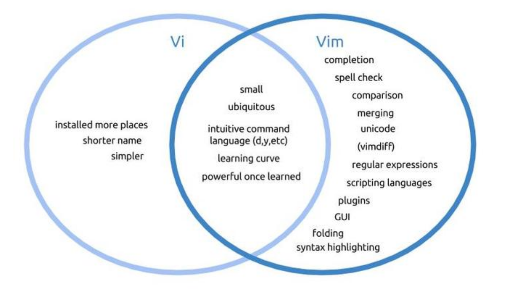

## Vim modes:
   *  **Insert mode:** used for writing text
   *  **Normal mode:** used for manipulating text
   *  **Command mode:** used for entering vim commands
   *  **Ex-mode:** Similar to the command-line mode but optimized for batch processing.
      *  vim starts in normal mode
      *  From normal mode **press i** to enter insert mode. The world **--INSERT--** will appear.
      *  To switch back to normal mode **press esc**.
      *  In the lack of the **esc key press ctrl + c**.

## Insert text:
   *  you can create a file and open **vim** at the same time by typing **vim** and a file name.
      *  Example:
         *  > vim notes.txt
      * In insert mode, you can use:
        * **The arrow keys** to move around,
        * **Enter Key** to continue in the next line,
        * **Backspace** for deleting.

## Saving and quitting vim
   *  To save a text file you need to enter **normal mode** using: and the use the **w** key.
      *  **:w** will save the file
      *  **:w new.txt** will save the file as new.txt
      *  **:wq** will save the file and quit
      *  **:wqa!** will save the file and close all files open in the buffer 

## Editing a file with wim


## Navigating a file
   *  In normal mode use the keys:
      *  H = left
      *  J = down
      *  K = up
      *  L = right
   * You can prefix the number of times by adding the number after the letter 10H will move 10 character to the left.

## Moving around Words, sentences, and paragraphs
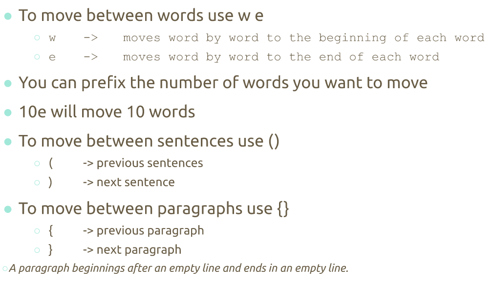

## Searching words in wim


## Screen movement
   *  G **uppercase g** Moves to end of the file
   *  gg **2 lowercase g** moves to the beginning of a file
   *  **ctrl + f** moves a page forward at a time
   *  **ctrl + b** moves a page backward at a time

## Moving to Lines


## Delete text and copy and paste


## Useful to Know

---

# Managing Data
## Basic Terminology
   *  **Backup:** Copies files and directories to an archive
   *  **System Backup**
   *  **Archive**
   *  List of important directories to include in system backup:
      *  /etc
      *  /home
      *  /opt
      *  /root
      *  /var

## Archiving utilities
   *  **Tar (tape archive):** create archives by combining files and directories into a single file.
   *  **CPIO:** Create an archive, restores files from an archive, copies a directory hierarchy.
      *  Create (copy-out) mode places multiple files into a single archive file
      *  Extract (copy-in) mode restores files from an archive
      *  Pass-through (copy-pass) mode copies a directory hierarchy.
   * **Ar:** creates, modifies, and extracts form archives.

## The tar program
   *  To create an archive
      *  > tar + option + archive name + files to add to archive
         *  The **option-f** is always required.
         *  Files inside an archive are called members.
   * To extract an archive:
     * > tar + options + file to extract


## The CPIO program 
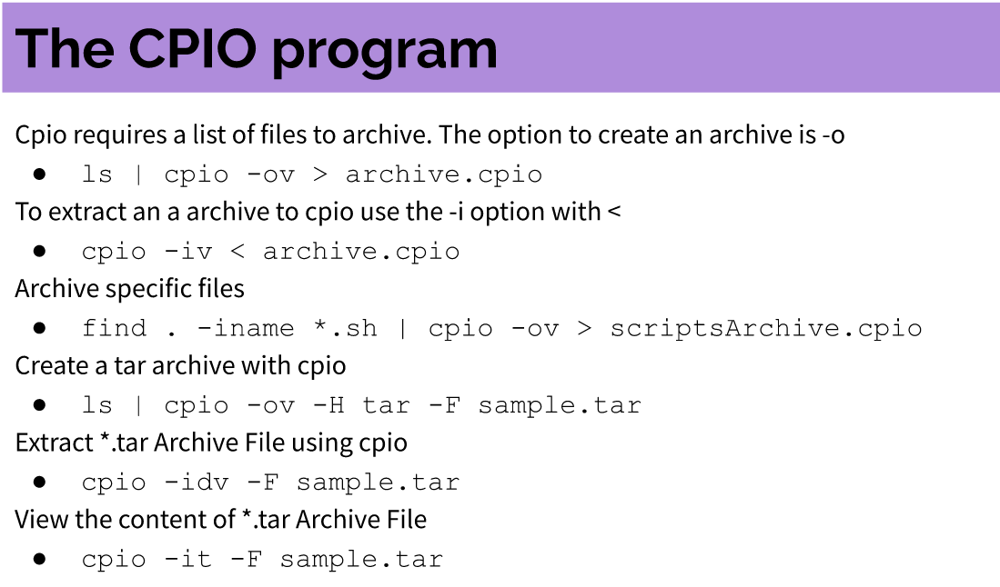

## The ar utility
The GNU **ar** program creates, modifies, and extracts from archives.
*  Archive files with **ar**
   *  > ar r test.a *.txt
*  List content of an archive
   *  > ar t test.a
*  Add a new member to an archive
   *  > ar r test.a test3.txt
*  Delete a member from archive
   *  > ar d test.a test3.txt

## File Compression

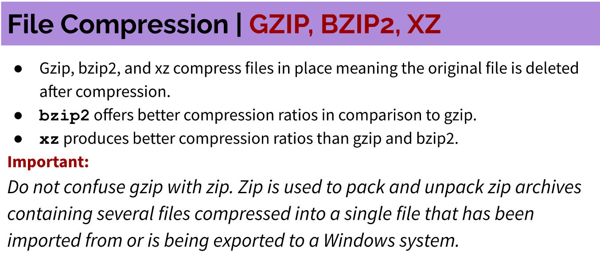

---
# Linux File Permissions
## Linux File Permissions | File Ownership
*  A file can be owned only by one user and one group.
*  The **/etc/passwd** file contains a list of all the users in Linux.

### Ls -l output review


### Linux File Permissions


## Linux File Permissions | Files vs Directories
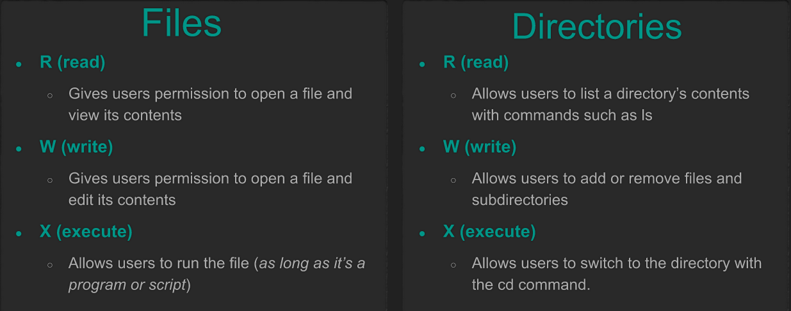

## Linux File Permissions | The chmod command
* the **chmod (change mode)** command is used to change permissions on files and directories. 
* It has this Syntax: **chmod permissions file/directory**
* You can use it in **two** ways to change file permissions:
  * Symbolic notation
  * Numeric notation

## Linux File Permissions | Symbolic Notation
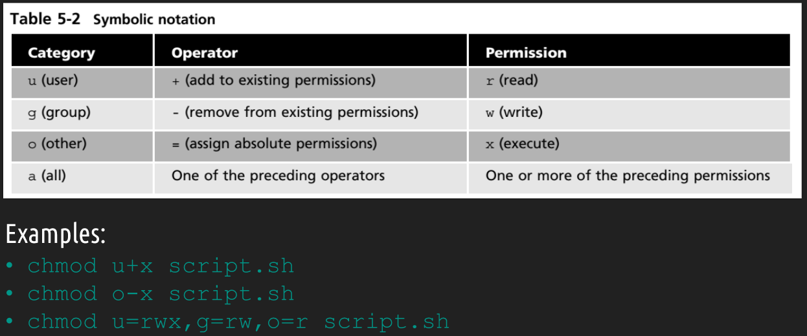

## Linux File Permission | Numeric Notation


# Managing Users and Groups
## Managing User Accounts

   *  How do I add a user in Ubuntu?
      *  Run the command **sudo adduser** followed by the **username**.
   *  How do I delete a user in Ubuntu?
      *  To delete a user use the **userdel -r** command followed by the **username**.
         *  The **-r** option for the command to delete the user and its home directory.

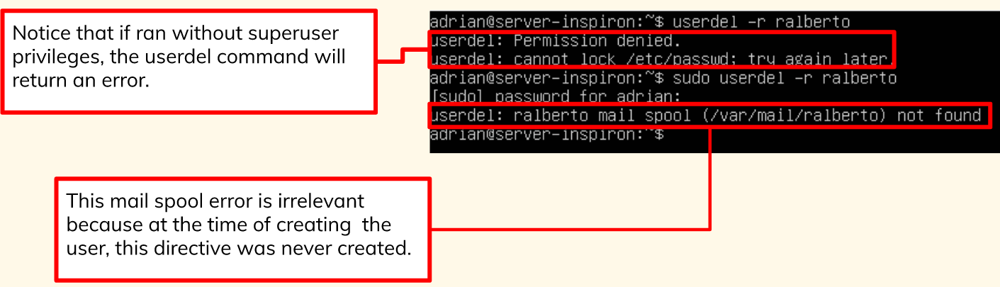
   *  Understanding the purpose of these files is canonical to the understanding of how users and groups work on in Linux.
      *  /etc/default/useradd
      *  /etc/passwd
      *  /etc/group ...

## The /etc/login.defs file
   *  It contains directives for use in various **shadow password suite commands**.
   *  **Shadow password suite** is an umbrella term for commands dealing with account.
      *  > grep -ve ^$ /etc/login.defs | grep -v ^#

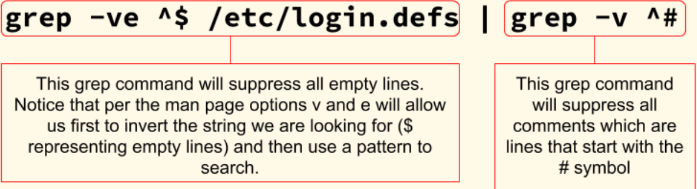# Shell Scripting

## Creating a basic script 
*  Start vim, enable line numbers, and enter insert mode.
*  Type:
```
#!/bin/bash
echo " to display info about your Linux system"
uname -a
```
> echo -n **does not output a new line**.

* Save the file and name it "name.sh"
* Type: **chmod u+x name.sh** to make the file executable.
* To run the script type: **./name.sh**

---

# Working with variables
## Shell scripting | Variables 


* A **shell variable** is similar to an environment variable, but its value is usually assigned in a shell script.
* Shell variables can be created in **two ways**:

Direct Assignment:
> color = blue

The Prompt MEthod:
> echo "Enter a color:";read color


* You can use **curly braces** to reference a variable's value: **${variable_name}**
* It is useful if you want to **append a string to a variable**.
* **Command Substitution:** allows the output of a command to replace the command itself.

Can be done in **TWO WAYS:**
``` 
$(command)
`command`
```

## Shell scripting | Exit Status Codes
**Exit status code:** a number sent to the shell when you run a command.

Type:
``` 
#!/bin/bash 
cd baddir 
echo $? 
```
   *  Successful commands usually return the **code 0**, and failures return a value **greater than 0**.
   *  to see an exit status use the **$? variable**.

--- 

# Using Structured Commands
if-then-Else statements, nesting if statements, test, compound testing, and case statements

## Shell scripting | Conditions


### Example
```
#!/bin/bash
if pwd
then
         echo "it worked"
fi
```
> if the **pwd** command executes successfully, the string **it worked** will be displayed


## Shell scripting | Comparison operators


A **case statement** uses one variable to specify multiple values and matches a portion of the script to each value.


## Shell scripting | Looping


