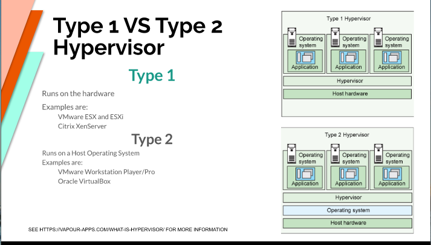
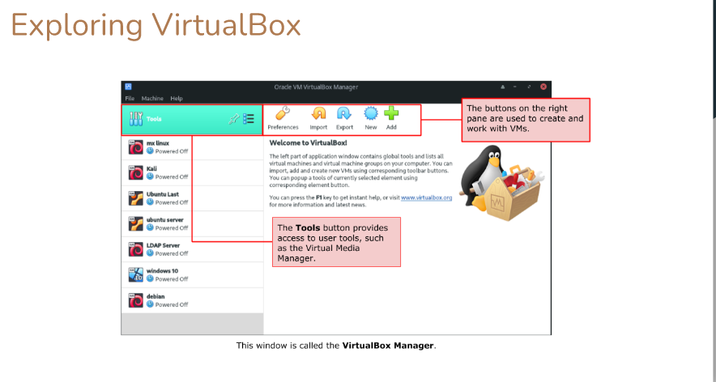
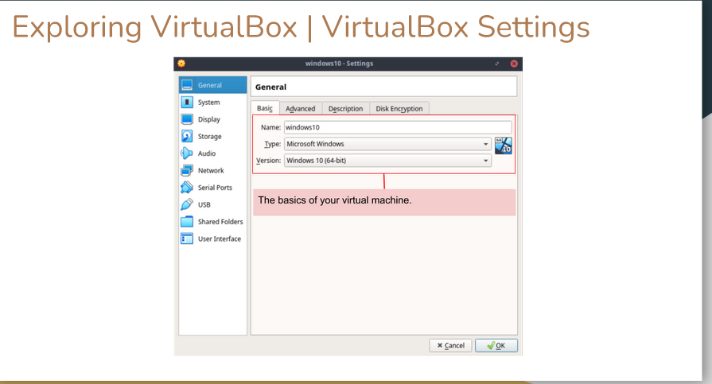
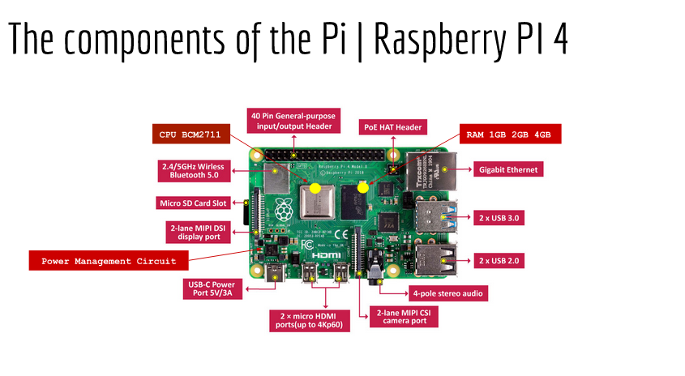
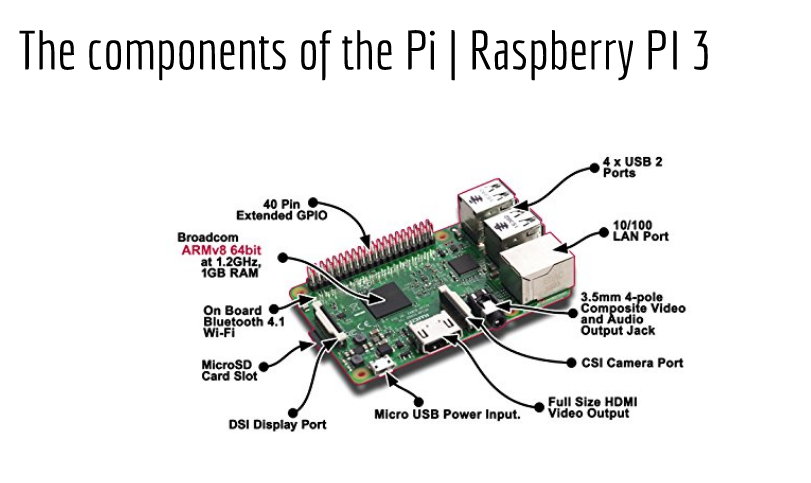
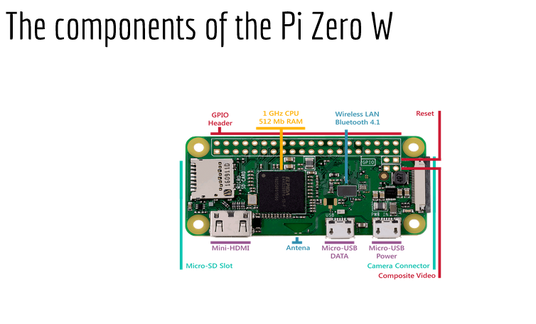
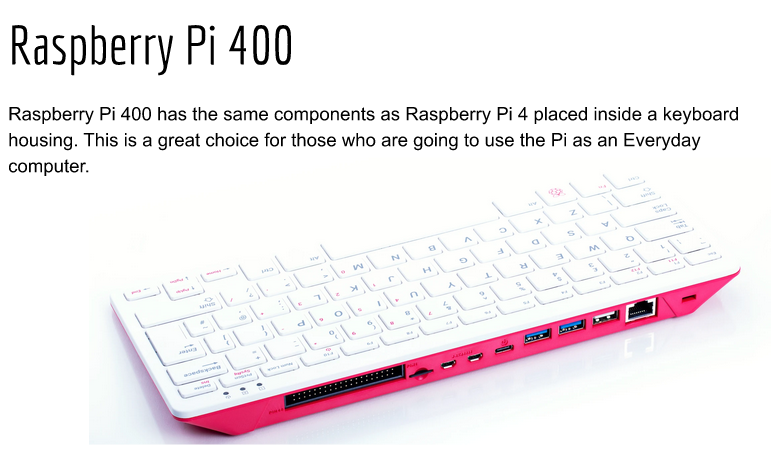
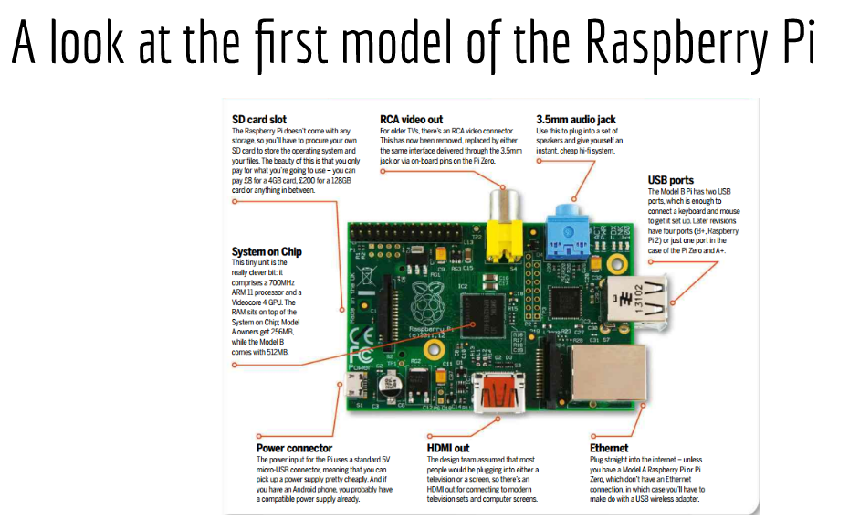
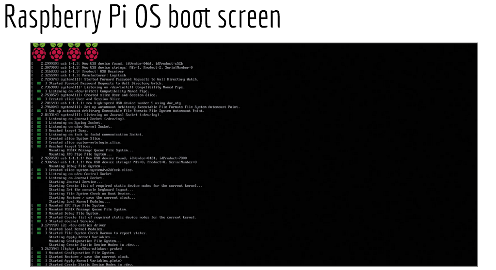

# The basic of Virtualization
## Definition
Replication of hardware o simulate a virtual machine inside a physical machine.

### Two type of virtualization:

* Server-side virtualization
* Client-side virtualization
 
## Server-side 
Virtual Desktop Infrastructure (VDI).
    
* Thick client or fat client
* Thin client
* Zero client

## Client-side 
* Software installed on a computer to manage virtual machines
* Each VM has its own OS installed
* The computer needs:
    * A hypervisor 
    * Hardware support
      * Capable CPU
      * Enough RAM
      * Enough STORAGE

## Type 1 Vs Type 2 Hypervisor

## Benefits of Virtualization 

+ Allows running multiple OSs on one machine.
+ Reduces costs by decreasing the physical hardware that must be purchased for a network.

### Example of VMs

+ VirtualBox
  + It is **Type 2** virtualization product 
  + Open Source software
  + supports a **Large** number of guest OSs

+ VMWare Workstation Player
  + Type 2
  + Available for **Linux** and **Windows**
  + supports a **Large** number of guest OSs

### Can my computer virtualize?

Your computer should meet the following minimal specifications:
+ AMD V or INTEL V compatible processor
+ DUAL core x64 processor with 1.3 GHz or faster 4GB of RAM
+ Enough free HARD DRIVE space for installing guest OSs.
---
# Using VirtualBox
## VirtualBOx Extension Pack

+ Base Package
+ Extension pack
  1. The virtual USB 2.0 (EHCI) device.  
  2. The virtual USB 3.0 (xHCI) device. 
  3. VirtualBox Remote Desktop Protocol (VRDP) support.
  4. Host webcam passthrough.
  5. Intel PXE boot ROM.
  6. Disk image encryption with AES algorithm.
+ To install VirtualBox Extension Pack just double click on the file.

## Exploring VirtualBox

## Creation a Virtual Machine with VirtualBox

> Click on this link: https://www.youtube.com/watch?v=tjHplNis2kE
---

# Installing Ubuntu 20.04 in VirtualBox

> Click on this link: https://www.youtube.com/watch?v=2MEN_IX8gJ8
---
# Raspberry PI
**Download the free ebook:** https://magpi.raspberrypi.org/books/beginners-guide-4th-ed

## What's a Raspberry PI?
+ The Raspberry pi is a low cost
+ Credit-card sized computer that plugs into a computer monitor or TV
+ It's capable of doing everything you'd expect a desktop computer to do.

### Raspberry pi Foundation 
+ The Raspberry pi Foundation is registered educational charity based in the UK
+ Goal is to advance the education of adults and children, particularly in the field of computer science and related subjects.

## PI COMPONENTS 
### The components of the Pi | Raspberry PI 4 

### The components of the Pi | Raspberry PI 3 

### The components of the Pi Zero W 

### The components of the Pi 3 A+ 

### The Raspberry Pi 400 

### A look at the first model of the Raspberry Pi

## Rasberry Pi SD-Card compatibility 
> https://elinux.org/RPi_SD_cards

## What Hardware Do I need?

## What Software do I need: 
+ Download **Raspberry Pi Imager**. 

# Working with Raspberry Pi Os 
## Raspberry Pi OS boot screen 

## Different Operating Systems for the Raspberry Pi
+ Ubuntu
+ Kali Linux
+ Diet pi
+ Arch Linux
+ Elementary OS
+ Manjaro
+ Windows 10
+ Android

## Where to buy?
+ Amazon
+ Microcenter

---

