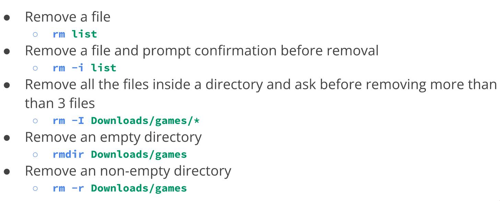
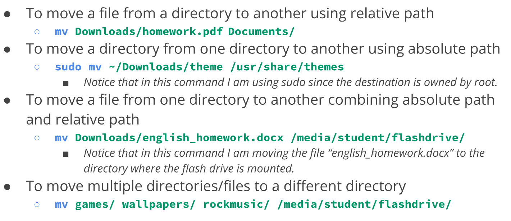
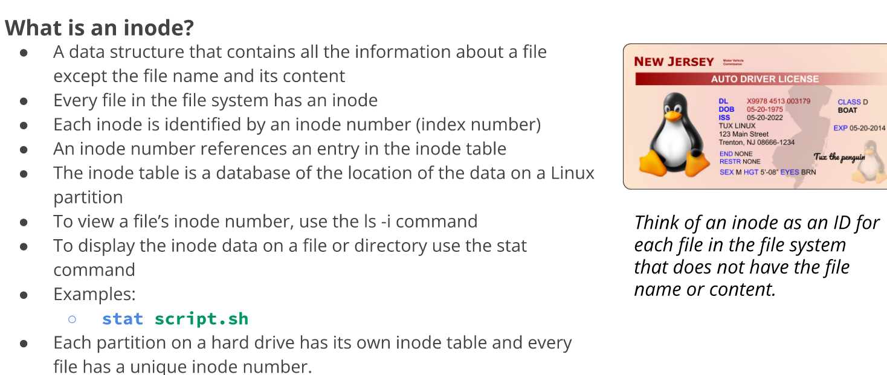
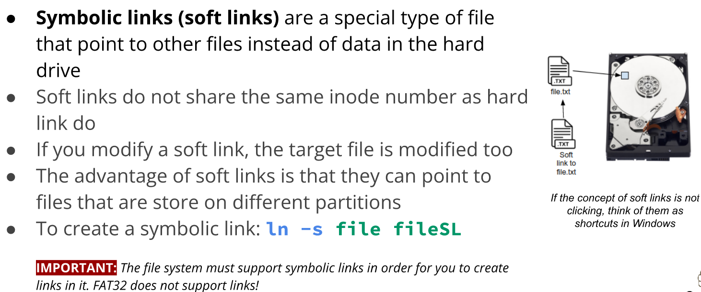
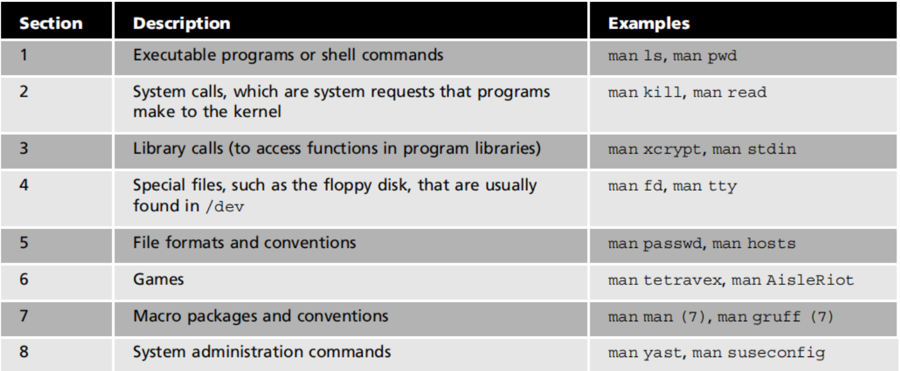
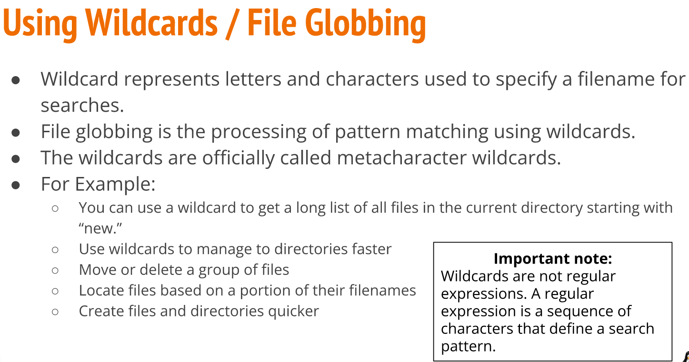
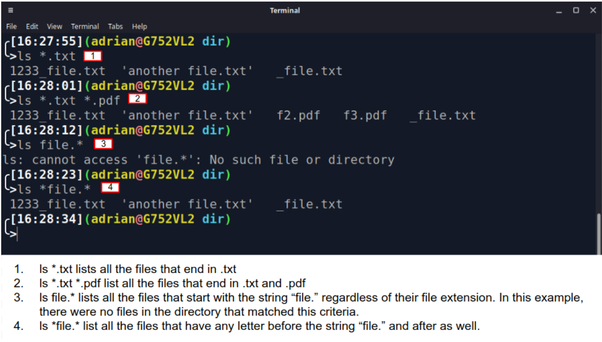
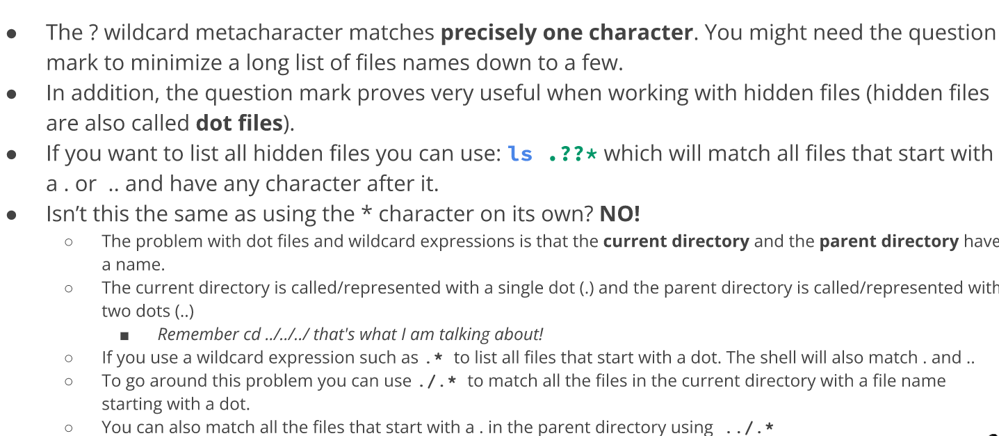
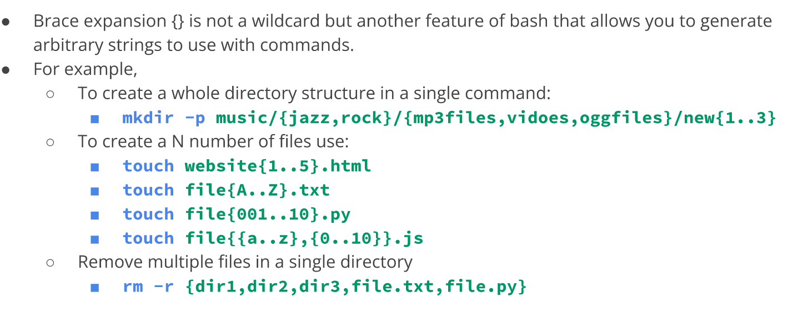

# Managing Files and Directories
## General Knowledge

# Creating files and Directories
## Creating directories 
### The *mkdi*r command
   *  *mkdir* is used for creating a single directory or multiple directories.
      > mkdir + the name of the directory.
   * To create multiple directories, separate each directory name with a space.
   * If you try to create a directory that already exists, you will get an error notifying you that the file already exists.

## Examples of the *mkdir* command

## Creating Files 
* The touch command
  * touch is used for creating files
    * Examples: 
      * To create a file called list
        * **touch** list
      * To create several files:
        * **touch** list_of_cars.txt Script.py names.csv
      * To create a file using absolute path:
        * **touch** ~/Downloads/games.txt
   > **Note: Creating files is not the designed purpose of the touch command. The touch command updates any given file's timestamp. But, if the file does not exists, it creates it. 

## Deleting files and directories
* The **rm** command
  * **rm** removes files. Does not removes directories.
  * To remove a non-empty directory use **rm** with the **-r** option.
  * To remove empty directories use the **rmdir** command.

## Examples of the *rm* command

# Moving and copying files and directories

## Moving files and directoires

**The *mv* command**
   *  mv moves and renames directores.
      *  > **mv** + source + destination
      *  > **nv** + file/directory to rename + new name
   * Both source and destination can be an **absolute or a relative path**.

## Examples of moving files and directories

## Examples of renaming files and directories
   *  To rename a file
      *  **mv** homework.docs cis106homework.docx
   *  To rename a file using absolute path
      *  **mv** ~/Downloads/homework.docs ~/Downloads/cis106homework.docx
   *  To move and rename a file in the same command
      *  **mv** Downloads/cis106homework.docs Documents/new_cis106homework.docx

## Copying files and directories 
### The *cp* command
*  **cp** copies files/directories from a source o a destination.
*  the **cp** command used the same structure as the **mv**
   *  > **cp** + files to copy + destination 
* To copy directories you must use the **-r** option 
   * > **cp -r** + directories to copy + destination 

## Examples of coying files and directories

# Working with links

## *Inodes* (index files )

## Hard Links

## Soft Links

## Getting Help 

   * Man (manual) pages are documentation files that describe Linux shell commands, executable programs, system calls, special files, and so forth.
   * To view the manual of a command type: **man** + command.
     * > Example:  **man ls**
   * To exit the **man** page press letter "**q**".
  
 

## Other ways of getting help

# Using *wildcards* (file globbing)

## The *Wildcard
   *  The main wildcard is a star, or asterisk (*) character.
   *  The **star alone** matches anything and nothing and matches any number of characters.
      *  For example, **ls *.txt**will match all files that end in **.txt**.
      *  Examples of when to use **the *wildcard:**
         *  to list all files with a particular file extension. 
         *  Do not remember the complete name of a file but you remember a prtion of the name.
         *  Want to copy, move, or remove all files that match a particular naming convention.

### Examples of *Wildcard

## The *? Wildcard*

## The *[] Wildcard*

## Using Brace Expansion

## Bonus
   * **ranger** - visual file manger
     * **Installation:** *sudo apt install ranger*
     * **Usage: ranger**
   * **Nnn**
     * **Installation:** *sudo apt install ranger*
     * **Usage: ranger**