# Handling Text Files

## Handling text files

   + Linux offers a lot of command line tools for handling text
     + cat
     + tac
     + more
     + less
     + head
     + diff
     + tail
     + cut
     + past
     + sort
     + wc
     + tr
     + grep

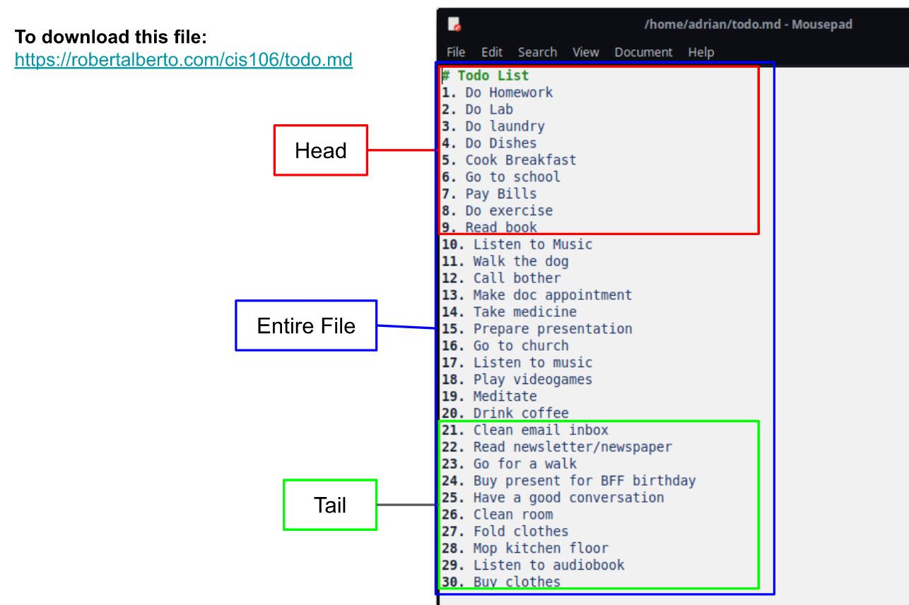

## Cat
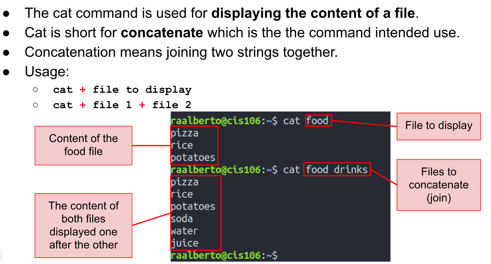

## Tac
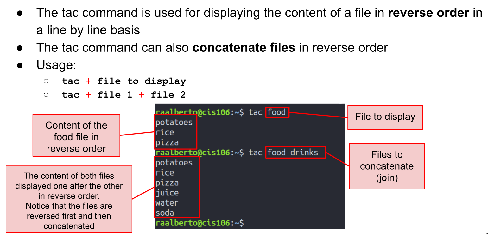

## More
   * The **more** command is a pager program used for displaying the content of text file one page at a time.
   * Usage:
     * > **more** + file to view.
     * > *For more information, read the man page of the more command*.

## Less
   * The **less** command is another pager program that displays the content of file 1 page at time.
   * **Less** is faster than more when dealing with large files since it loads 1 page at time.
     * Usage:
       * > **less** + file to view
       * > *For more information, read the man page of the more command*.

## Head
   * The **head** command displays the top **N** number of lines of a given file.
   * By default, it prints the first 10 lines.
     * Usage:
       * > **head** + **option** + **file**
       * > *For more information, read the man page of the more command*.

## Tail
   * The **tail** command displays the las **N** number of lines a given file.
   * By default, it prints the last 10 lines.
     * Usage:
       * > **tail** + **option** + **file**
       * > *For more information, read the man page of the more command*.

## cut 
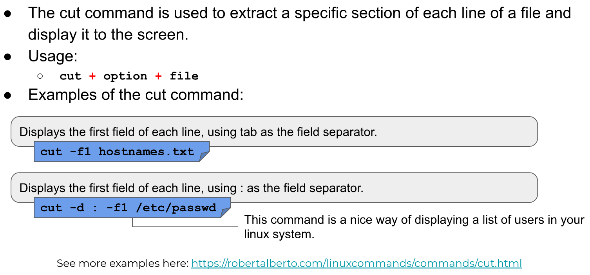

## Paste
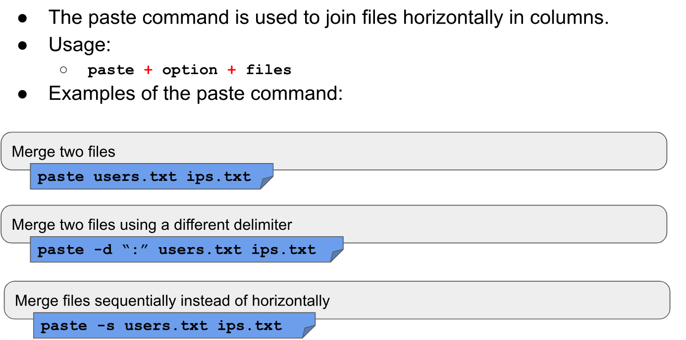

## Sort
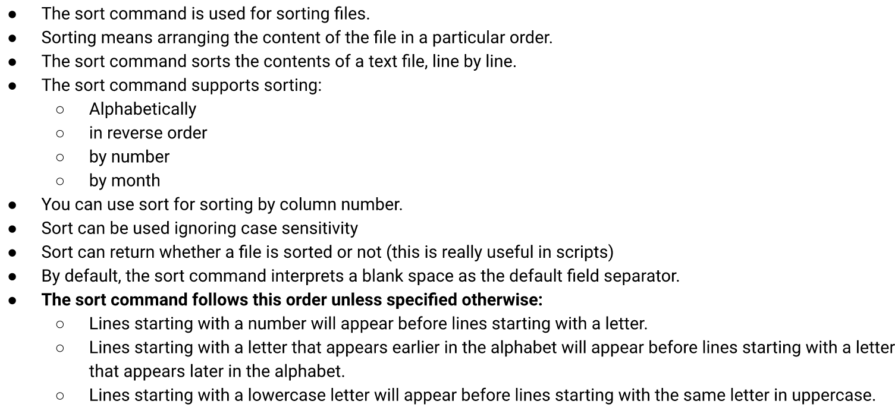
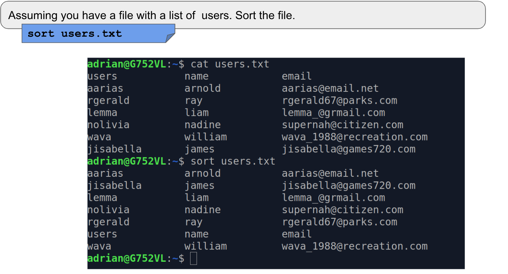

## wc
   * The **wc** command is used for printing the number of lines, and bytes in a file.
   * Usage:
     * > **wc** + **option** + **file**

## Tr
   * The **tr** command is used for translating or deleting characters from standard output.
     * > **standard output** | **tr** + **option** + **set** + **set**

## Diff
   * The **diff** command compares files and displays the differences between them 
     * > diff + option + file1 + files2

## Grep 
   * The **grep** command is used to match a string pattern from a file or standard output when using the pipe
     * > grep + option + pattern to match + file
     * standard output + pipe | + grep + pattern to match

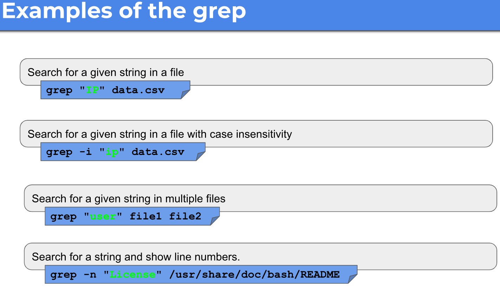

## Rev
   * The **rev** command is used for reversing the characters position in a given text.
     * > **rev** + file

# Working with I/O Redirection.
   * In Inux, we can redirect the **input and output** of commands to and from files, as well as connect multiple commands together into powerful command piperlines.

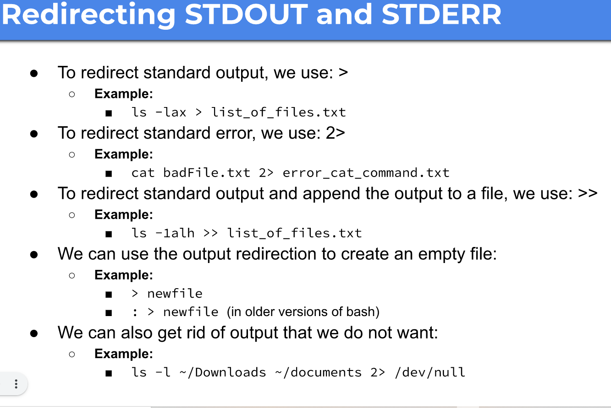
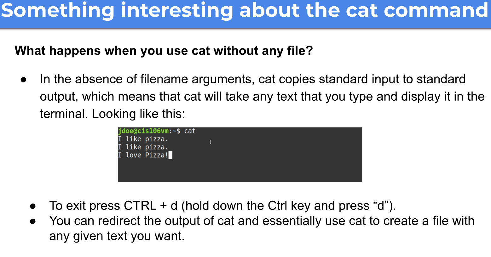

## The pipe (|)
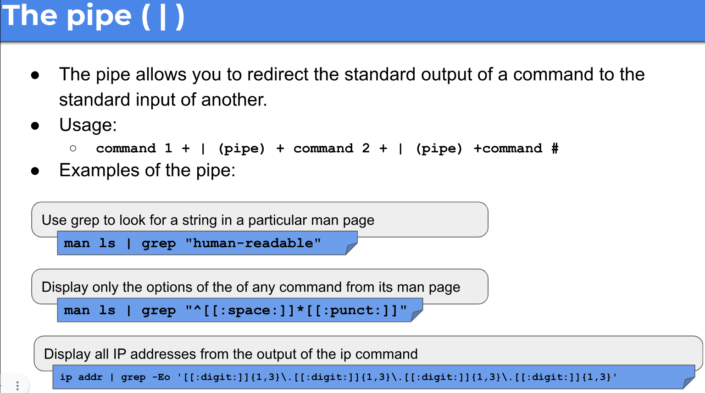

# Alias
## Creating you own commands with alias
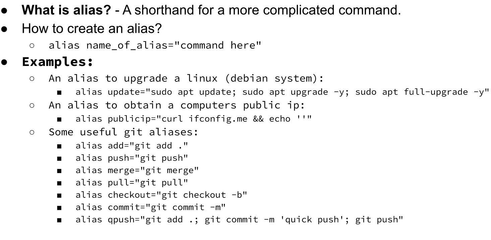
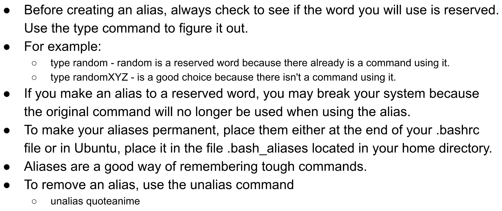

## Sources
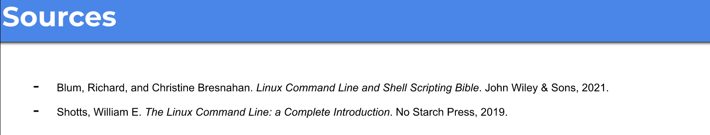