# Vim
## What is WIM

*  The **vi command-line** text editor is included in all POSIX compliant OS.
*  The **vi command** is now linked to the **vim command**.
*  Even when you issue the **vi command**, you're actually starting the **vim editor**.
   *  To install vim
      *  > sudo apt install vim
   * If **vi** is installed in all Linux distros, Why am i learning **VIM**?
     * vim had more features
     * vim is also light weight

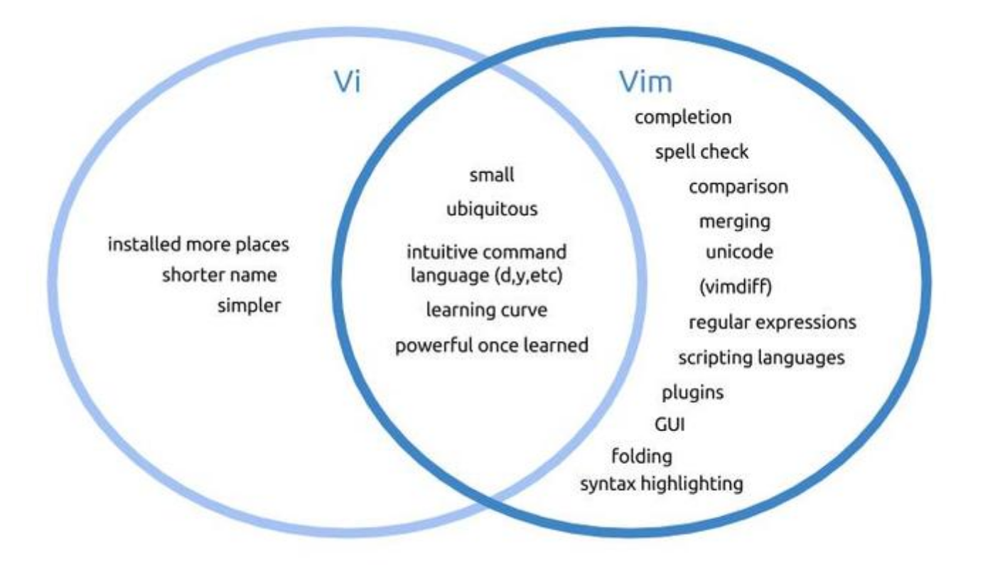

## Vim modes:
   *  **Insert mode:** used for writing text
   *  **Normal mode:** used for manipulating text
   *  **Command mode:** used for entering vim commands
   *  **Ex-mode:** Similar to the command-line mode but optimized for batch processing.
      *  vim starts in normal mode
      *  From normal mode **press i** to enter insert mode. The world **--INSERT--** will appear.
      *  To switch back to normal mode **press esc**.
      *  In the lack of the **esc key press ctrl + c**.

## Insert text:
   *  you can create a file and open **vim** at the same time by typing **vim** and a file name.
      *  Example:
         *  > vim notes.txt
      * In insert mode, you can use:
        * **The arrow keys** to move around,
        * **Enter Key** to continue in the next line,
        * **Backspace** for deleting.

## Saving and quitting vim
   *  To save a text file you need to enter **normal mode** using: and the use the **w** key.
      *  **:w** will save the file
      *  **:w new.txt** will save the file as new.txt
      *  **:wq** will save the file and quit
      *  **:wqa!** will save the file and close all files open in the buffer 

## Editing a file with wim
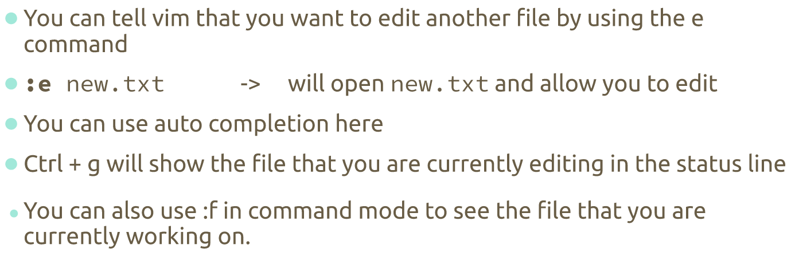

## Navigating a file
   *  In normal mode use the keys:
      *  H = left
      *  J = down
      *  K = up
      *  L = right
   * You can prefix the number of times by adding the number after the letter 10H will move 10 character to the left.

## Moving around Words, sentences, and paragraphs
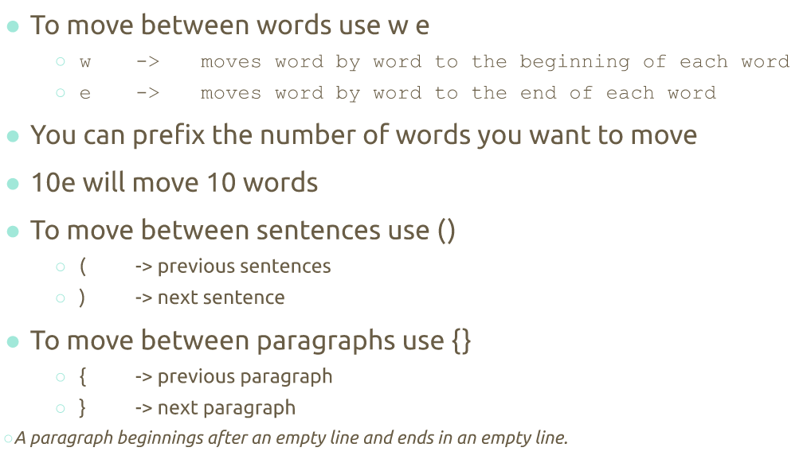

## Searching words in wim
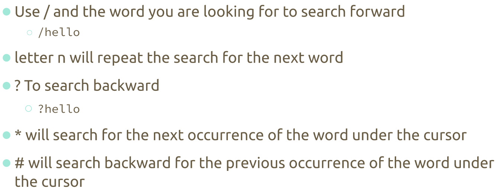

## Screen movement
   *  G **uppercase g** Moves to end of the file
   *  gg **2 lowercase g** moves to the beginning of a file
   *  **ctrl + f** moves a page forward at a time
   *  **ctrl + b** moves a page backward at a time

## Moving to Lines
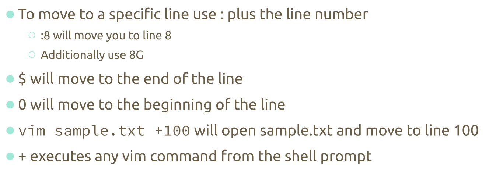

## Delete text and copy and paste
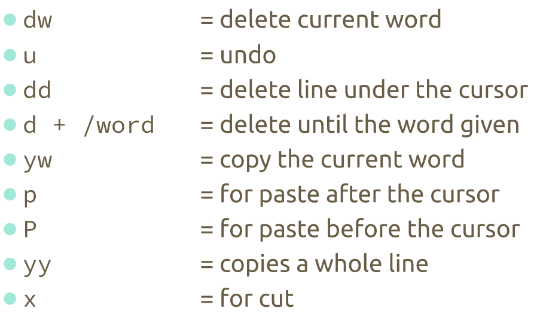

## Useful to Know
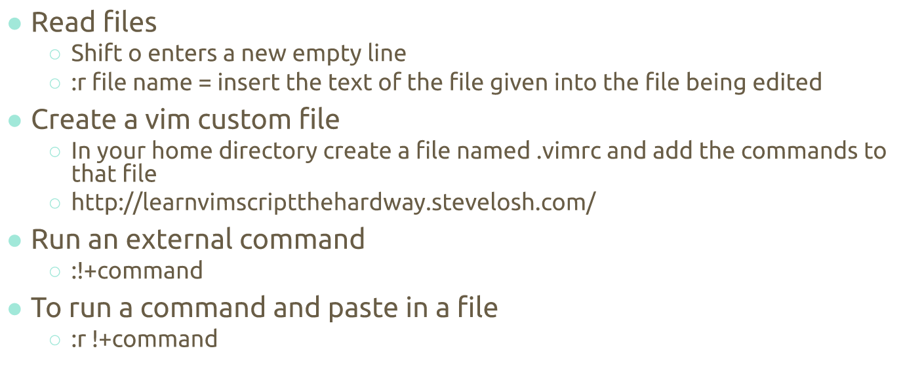
---

# Managing Data
## Basic Terminology
   *  **Backup:** Copies files and directories to an archive
   *  **System Backup**
   *  **Archive**
   *  List of important directories to include in system backup:
      *  /etc
      *  /home
      *  /opt
      *  /root
      *  /var

## Archiving utilities
   *  **Tar (tape archive):** create archives by combining files and directories into a single file.
   *  **CPIO:** Create an archive, restores files from an archive, copies a directory hierarchy.
      *  Create (copy-out) mode places multiple files into a single archive file
      *  Extract (copy-in) mode restores files from an archive
      *  Pass-through (copy-pass) mode copies a directory hierarchy.
   * **Ar:** creates, modifies, and extracts form archives.

## The tar program
   *  To create an archive
      *  > tar + option + archive name + files to add to archive
         *  The **option-f** is always required.
         *  Files inside an archive are called members.
   * To extract an archive:
     * > tar + options + file to extract

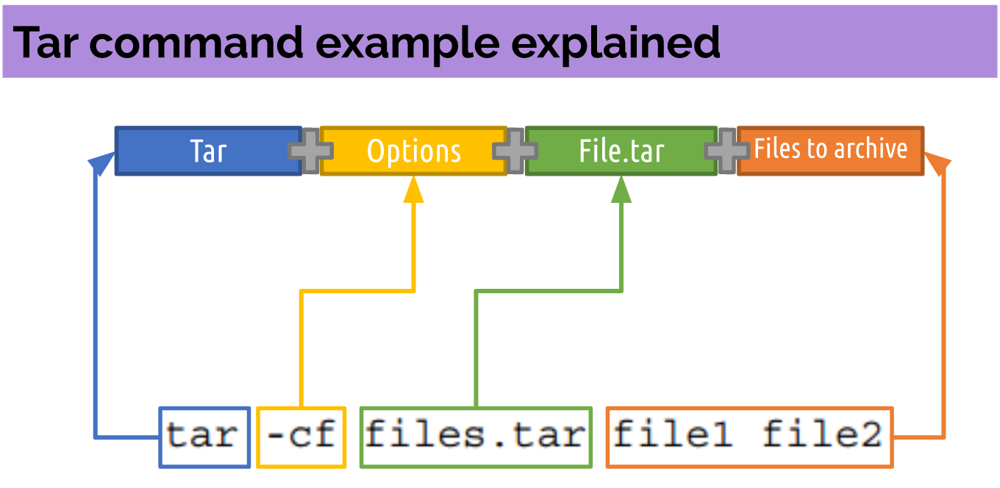

## The CPIO program 
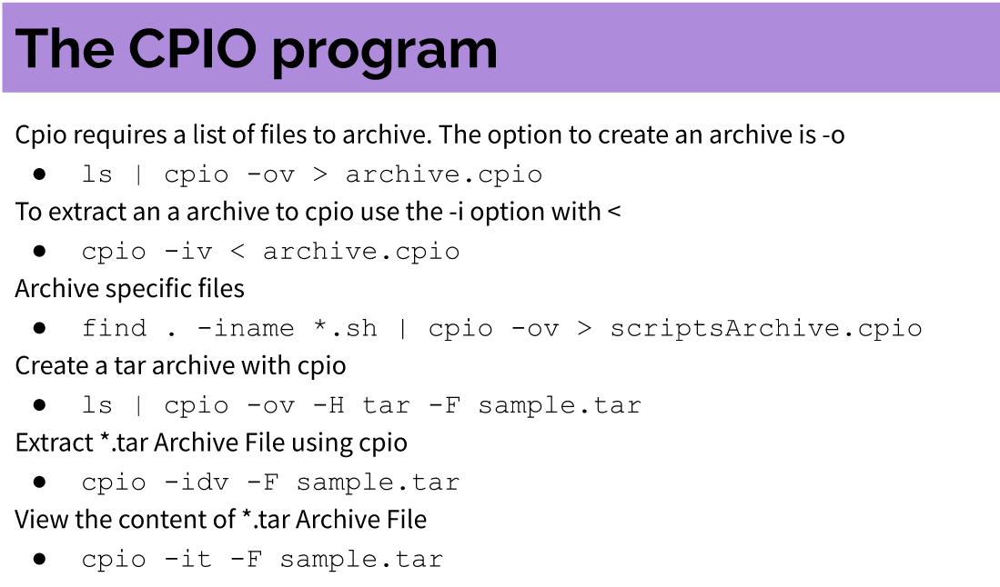

## The ar utility
The GNU **ar** program creates, modifies, and extracts from archives.
*  Archive files with **ar**
   *  > ar r test.a *.txt
*  List content of an archive
   *  > ar t test.a
*  Add a new member to an archive
   *  > ar r test.a test3.txt
*  Delete a member from archive
   *  > ar d test.a test3.txt

## File Compression
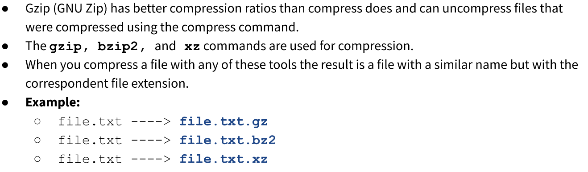
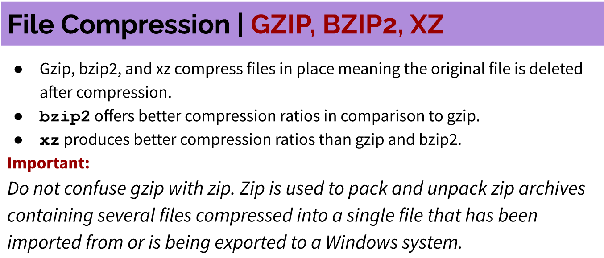
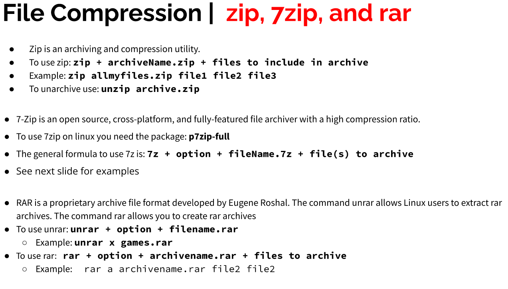
---
# Linux File Permissions
## Linux File Permissions | File Ownership
*  A file can be owned only by one user and one group.
*  The **/etc/passwd** file contains a list of all the users in Linux.

### Ls -l output review
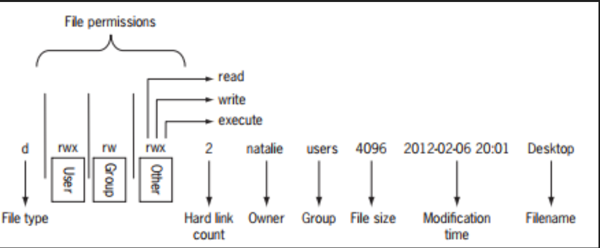

### Linux File Permissions
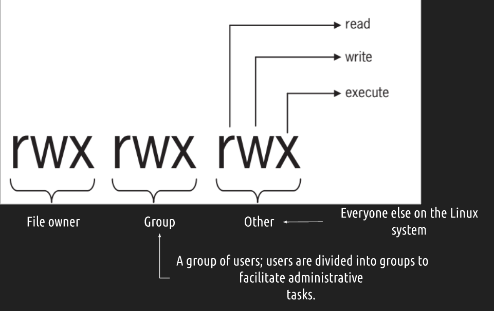

## Linux File Permissions | Files vs Directories
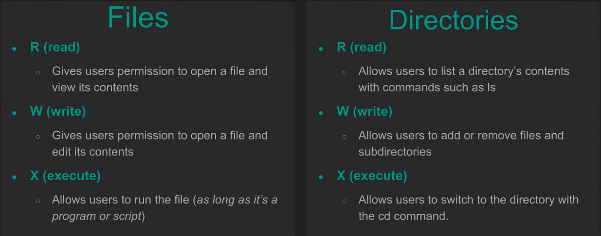

## Linux File Permissions | The chmod command
* the **chmod (change mode)** command is used to change permissions on files and directories. 
* It has this Syntax: **chmod permissions file/directory**
* You can use it in **two** ways to change file permissions:
  * Symbolic notation
  * Numeric notation

## Linux File Permissions | Symbolic Notation
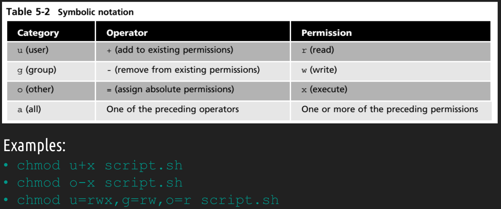

## Linux File Permission | Numeric Notation
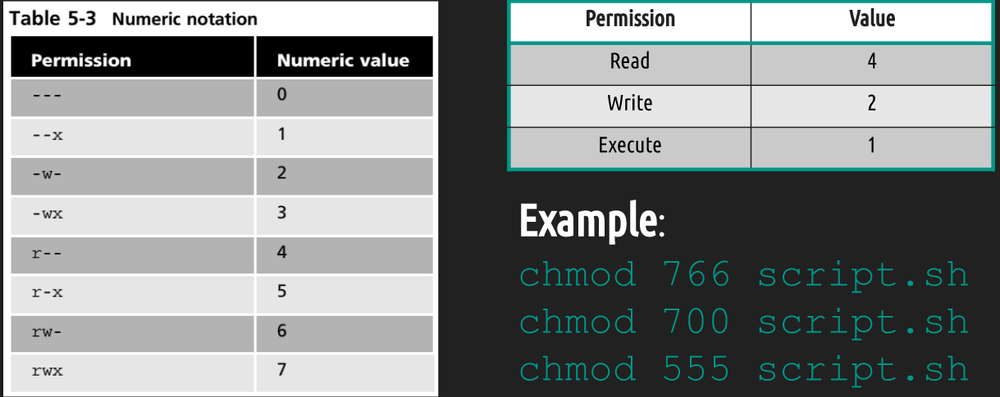

