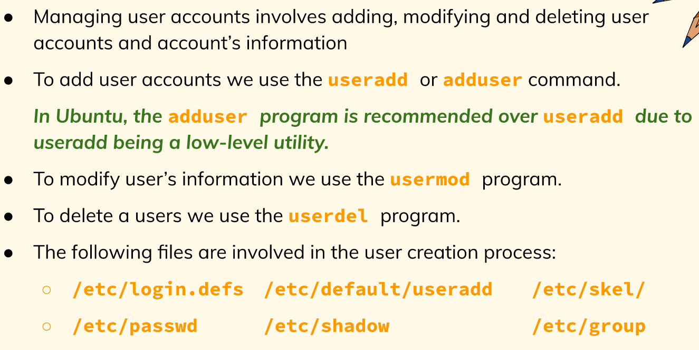
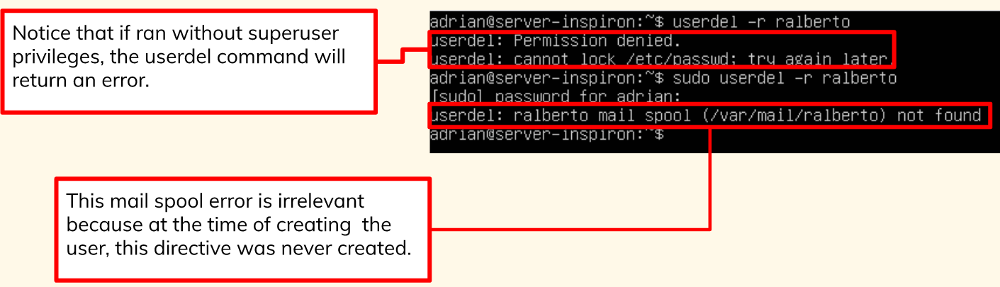
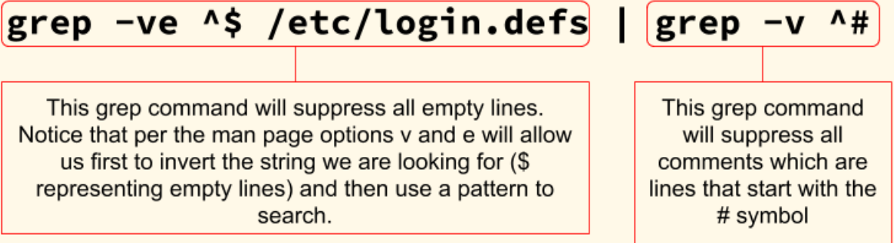
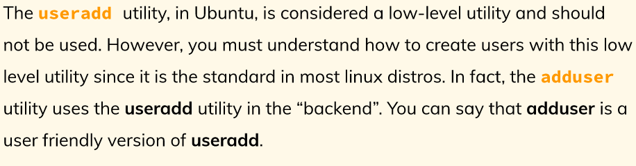
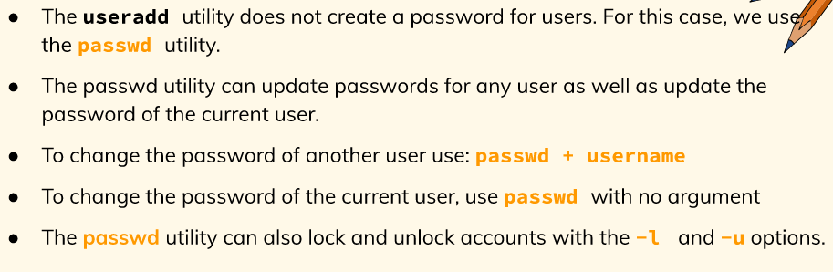
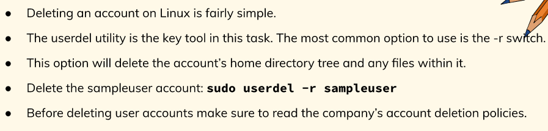
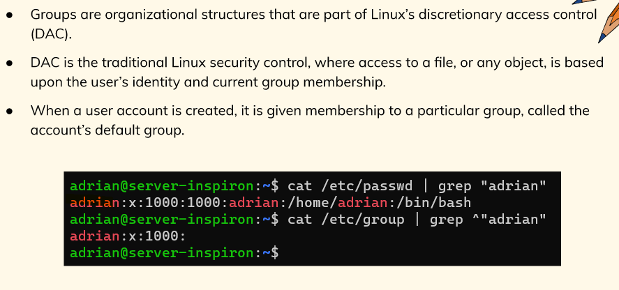
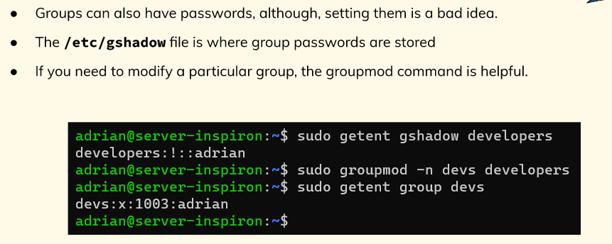
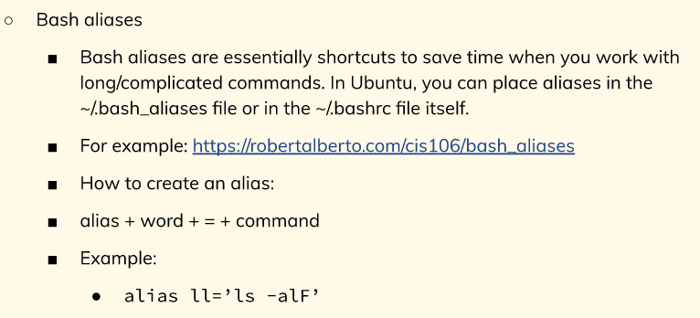

# Managing Users and Groups
## Managing User Accounts

   *  How do I add a user in Ubuntu?
      *  Run the command **sudo adduser** followed by the **username**.
   *  How do I delete a user in Ubuntu?
      *  To delete a user use the **userdel -r** command followed by the **username**.
         *  The **-r** option for the command to delete the user and its home directory.

   *  Understanding the purpose of these files is canonical to the understanding of how users and groups work on in Linux.
      *  /etc/default/useradd
      *  /etc/passwd
      *  /etc/group ...

## The /etc/login.defs file
   *  It contains directives for use in various **shadow password suite commands**.
   *  **Shadow password suite** is an umbrella term for commands dealing with account.
      *  > grep -ve ^$ /etc/login.defs | grep -v ^#

## Creating a user with useradd

* **-md** are the options needed for adding a home directory to the new user.
* **-s** used for specifying the users login shell.

## Maintaining Passwords

## Deleting User Accounts

## Managing Groups

## Delete me

## Bash Aliases

