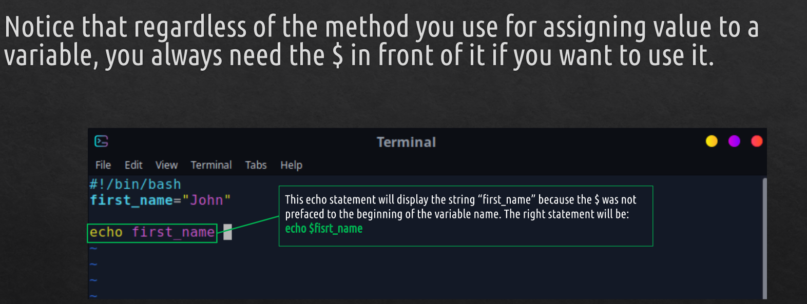
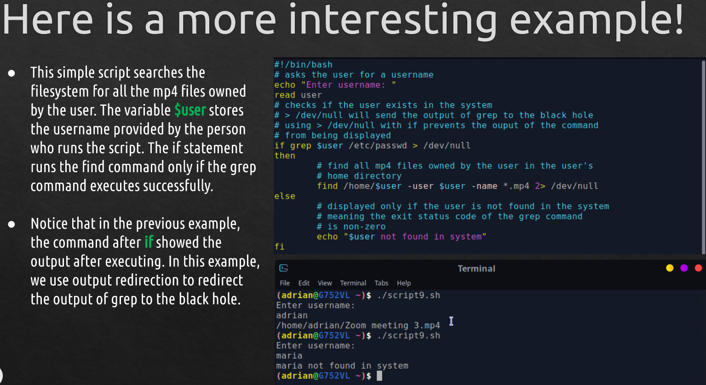
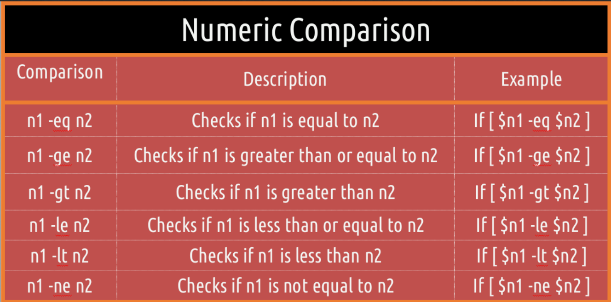
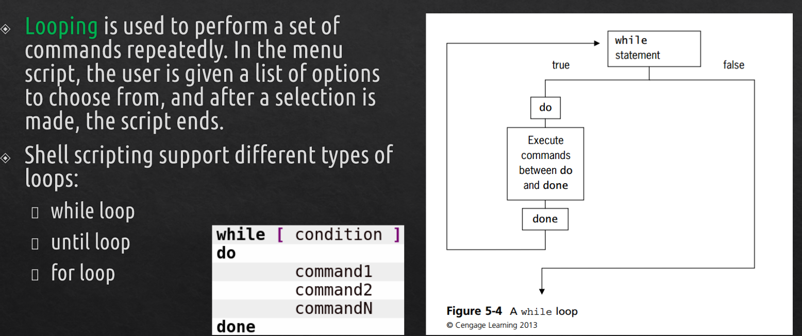
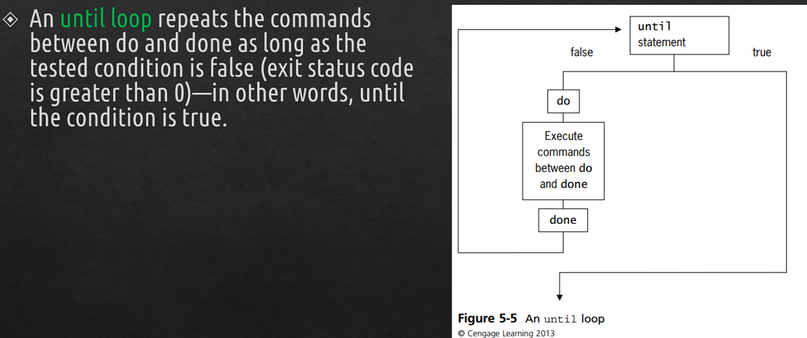
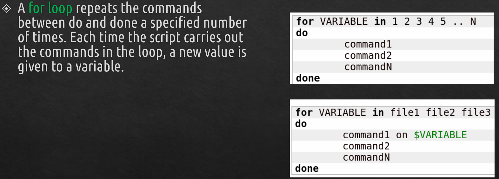

# Shell Scripting

## Creating a basic script 
*  Start vim, enable line numbers, and enter insert mode.
*  Type:
```
#!/bin/bash
echo " to display info about your Linux system"
uname -a
```
> echo -n **does not output a new line**.

* Save the file and name it "name.sh"
* Type: **chmod u+x name.sh** to make the file executable.
* To run the script type: **./name.sh**

---

# Working with variables
## Shell scripting | Variables 


* A **shell variable** is similar to an environment variable, but its value is usually assigned in a shell script.
* Shell variables can be created in **two ways**:

Direct Assignment:
> color = blue

The Prompt MEthod:
> echo "Enter a color:";read color



* You can use **curly braces** to reference a variable's value: **${variable_name}**
* It is useful if you want to **append a string to a variable**.
* **Command Substitution:** allows the output of a command to replace the command itself.

Can be done in **TWO WAYS:**
``` 
$(command)
`command`
```

## Shell scripting | Exit Status Codes
**Exit status code:** a number sent to the shell when you run a command.

Type:
``` 
#!/bin/bash 
cd baddir 
echo $? 
```
   *  Successful commands usually return the **code 0**, and failures return a value **greater than 0**.
   *  to see an exit status use the **$? variable**.

--- 

# Using Structured Commands
if-then-Else statements, nesting if statements, test, compound testing, and case statements

## Shell scripting | Conditions


### Example
```
#!/bin/bash
if pwd
then
         echo "it worked"
fi
```
> if the **pwd** command executes successfully, the string **it worked** will be displayed



## Shell scripting | Comparison operators




A **case statement** uses one variable to specify multiple values and matches a portion of the script to each value.


## Shell scripting | Looping


